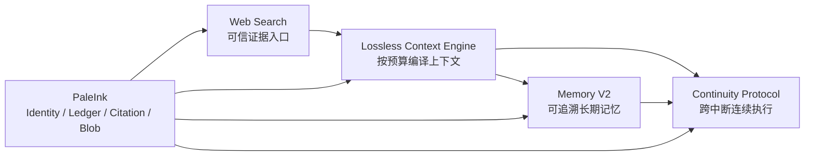

# RikkaHub 智能对话核心能力演进阶段任务书

> 状态：F0～F5 v1 工程实现完成，进入真机/真实 Provider 验收与发布观察期（Roadmap v1.3）
> 日期：2026-08-08
> 范围：Web Search、无损 Context Engine、Memory V2、连续性协议
> 产品定位：Android-first 的智能对话应用，不复制桌面 coding agent 的任意文件修改工作流，但吸收其上下文治理、恢复、记忆和可审计执行能力。

## 1. 文档地位与范围决策

本文把四项紧密相关的 Agent 核心能力组织成一条可交付、可迁移、可验收的主线。它定义依赖关系、工作包、完成门槛和禁止事项；后续每个阶段仍需建立独立实施计划、风险清单和变更集。本文本身不授权立即修改运行时代码。

相关权威文档：

- `PALE6_FOUNDATION_ARCHITECTURE.md`：稳定身份、ConversationStore、RequestLedger、Citation、MediaAsset 与单一真值层。
- `WEB_SEARCH_ARCHITECTURE.md`：Web Search 的 Provider、Gateway、终态、预算和引用详细合同。
- `ANDROID_FIRST_MULTIPLATFORM_ARCHITECTURE.md`：共享 product kernel、薄宿主和 Android 能力上限。

### 1.1 明确拆出的独立大任务

以下能力不属于本文阶段路线，也不进入当前排期：

- DOCX/XLSX/PPTX 的创建、修改、预览与格式兼容。
- Artifact Runtime、Artifact Backend、云端代码执行沙箱及 Office 工具链。
- WPS/Office 外部编辑、重新导入形成新版本以及文档版本管理。
- Office Skill 的选型、许可证、依赖环境、模板体系和质量基准。

这些能力涉及独立的执行框架、云端基础设施、文件安全、商业许可证和 Office 兼容性，应在未来以单独的产品与架构任务重新讨论。本文不得被解释为已经确定其技术方案、Provider 或实施时间。

## 2. 总体结论

正式路线不是把更多内容不断塞进 prompt，也不是给聊天页增加彼此独立的功能开关，而是建立一条统一的信息与连续性脊柱：



能力间的因果关系：

1. Web Search 先解决“搜索后无回复”、引用不稳和大结果挤爆上下文，为 Context Engine 提供首个高压场景。
2. Context Engine 把不可变会话事实编译成有预算、可解释的模型视图，避免用破坏历史的摘要换取上下文空间。
3. Memory V2 在 Context Engine 的来源、预算和冲突合同上提供长期、可撤销、可追溯的个性化记忆。
4. 连续性协议保存可恢复执行语义，而不是一段模糊摘要；它让搜索、长回答和工具回合在进程死亡后安全继续。

## 3. 产品边界

### 3.1 本路线要做什么

- 让联网搜索最终一定产生用户可见回答或明确失败，并保持引用、时效和证据链。
- 让长会话在上下文窗口受限时仍保留事实、分支、工具配对、引用和恢复能力。
- 让记忆可查看、可编辑、可禁用、可追溯来源，而不是隐藏的全局 prompt 拼接。
- 让 Android App 在前后台切换、进程回收和设备重启后能够安全恢复聊天与搜索任务。
- 为未来 Windows/iOS/Web 提供共享领域合同，但 Android 保持第一交付面。

### 3.2 本路线不做什么

- 不照搬 coding agent 的任意 shell、仓库编辑、git、进程控制和无限文件读取权限。
- 不把 Context Engine 变成第二份 ConversationStore，不覆盖或删除历史消息来制造“短上下文”。
- 不把 Memory V2 变成自动收集全部聊天的黑盒用户画像。
- 不把进程恢复等同于无条件重发 Provider 请求；未知计费结果仍遵守 RequestLedger。
- 不在本路线内建设通用文件创作框架、Office Renderer 或云端 Artifact Worker。

### 3.3 与 `G:\claude-code` 的取舍

值得吸收：

- 以真实 token 使用和模型窗口触发 auto compact，而不是只按消息条数裁剪。
- compact boundary 是可识别事件；summary 之外仍需恢复近期尾部、计划、已读资源、工具与执行状态。
- session memory、跨会话 memory 和当前上下文压缩属于不同层，不能混成一份摘要。
- 大型工具结果应外置，主上下文只留有界预览和可检索句柄。
- 连续压缩失败需要 circuit breaker，不能无限消耗 token 重试。

RikkaHub 不直接复制：

- coding agent 的代码文件、git 状态和 shell 输出不是移动对话 App 的默认连续性内容，应替换为附件、搜索 Evidence、用户决策、表单/审批与未决问题。
- 任意文件/命令恢复不能成为默认权限；手机端只恢复经过能力和权限合同声明的动作。
- compact summary 不能成为历史真值。RikkaHub 应保留原消息，把 summary 建成带 source refs 的可重建投影。
- memory 文件入口适合开发工具，但 App 产品需要结构化 scope、冲突、敏感性、用户控制和跨设备迁移合同。

## 4. 统一目标架构

### 4.1 三个不可混淆的数据平面

| 平面 | 权威内容 | 可否改写 | 主要消费者 |
| --- | --- | --- | --- |
| Source Plane | Conversation/MessagePart、Provider 原始块、Tool output、Evidence、Memory、ContentBlob | 已提交记录不可原地改写 | 审计、恢复、重新编译、导出 |
| Context Plane | 针对某次 Request 编译的 Context Manifest 与 Provider payload | 可重建，不是长期真值 | LLM Provider |
| Projection Plane | Android/Web UI、通知、搜索卡、记忆卡、任务状态 | 可重建 | 用户界面 |

“无损”指 Source Plane 不因截断、压缩或 Provider 编码而丢失，并不意味着每次都把全部历史发送给模型。

### 4.2 共享核心合同

```text
ContentBlob
  blobId / sha256 / mime / byteSize
  ownerType / ownerId / privacyScope
  encryption / retention / storageState

ContextManifest
  manifestId / requestId / compilerVersion
  modelWindow / reservedOutput / safetyMargin
  ordered ContextEntry[]
  includedTokens / excludedTokens / exclusionReasons
  sourceDigest / capabilitySnapshotId

ContextEntry
  sourceRef / semanticKind / trustLevel
  required | compressible | retrievable
  originalTokenEstimate / compiledTokenEstimate
  transform / evidenceRefs / citationRefs

MemoryRecord
  memoryId / type / scope / canonicalStatement
  sourceRefs / confidence / sensitivity / status
  revision / supersedes / conflictsWith / expiresAt

ContinuityCheckpoint
  checkpointId / requestId / attemptId
  state / billableBoundary / reducerVersion
  committedOutputs / pendingLocalActions
  providerReplayRefs / contextManifestId
  resumePolicy / userDecisionRequired
```

这些合同优先采用纯 Kotlin、版本化、确定性序列化，并由平台宿主实现数据库、文件、网络、后台和通知能力。

### 4.3 单一运行时真值

- ConversationStore 是消息与分支真值。
- RequestLedger 是请求、attempt、付费边界和恢复状态真值。
- ContentBlob/MediaAsset 是不可变内容字节真值。
- Citation/Source 是引用关系真值。
- Context Manifest、Memory selection、搜索卡和任务 UI 都是可重建投影，不得自行维护第二状态机。

## 5. 总阶段与依赖

| 阶段 | 目标 | 关键工作包 | 依赖 | 发布门禁 |
| --- | --- | --- | --- | --- |
| F0 | 共享合同与观测基线 | F0-1～F0-5 | PaleInk 对应合同已冻结 | 可观测但不改行为；fixture 可重放 |
| F1 | Web Search 可靠闭环 | WS-1～WS-5 | F0 | 有结果必有最终文本或明确失败 |
| F2 | 无损 Context Engine | CE-1～CE-7 | F0；以 F1 为压力场景 | 历史不丢、预算确定、manifest 可解释 |
| F3 | Memory V2 | MV2-1～MV2-7 | F2 | 记忆有来源、作用域、冲突和撤销 |
| F4 | 连续性协议 | CP-1～CP-7 | F2；RequestLedger；F3 可并行 | 中断后不重复付费、不丢已提交结果 |
| F5 | 产品化收口 | PX-1～PX-5 | F1～F4 | 质量、隐私、成本、迁移全部达标 |

F1 的终态修复应尽早交付。F2 开始后，Provider-native 搜索适配、Memory 数据建模和 Continuity fixture 可以在不复制真值层的前提下并行推进。

## 6. F0：共享合同与观测基线

### F0-1 现状与故障基线

- 固定当前 `GenerationHandler`、`Message.limitContext`、手动会话压缩、MemoryRepository、SearchTools 和 RequestLedger 的行为矩阵。
- 收集离线 fixture：长会话、tool pair、多分支、30/100 条搜索结果、Provider pause/incomplete、超大附件、进程死亡和历史损坏。
- 建立指标但不改变生产行为：上下文估算量、丢弃原因、搜索终态、memory 注入量和 resume 决策。

### F0-2 ContentBlob 统一合同

- 在领域层定义通用不可变 ContentBlob，复用现有 MediaAsset/managed-file 物理能力，不新增 search-only 或 memory-only 文件仓库。
- 支持 owner、privacy scope、MIME、hash、retention、encryption、replica 和 GC reachability。
- 迁移采用引用补建和双读/对账，不在数据库 migration 中搬运大文件。

### F0-3 Turn Outcome 与 reducer 合同

- 定义跨普通生成和搜索共用的 terminal outcome、billable boundary、local commit、unknown outcome 和 cancel 语义。
- 各领域只实现专用 reducer；`:app` 负责 I/O，不独占状态迁移规则。

### F0-4 Context Manifest schema

- 先定义 manifest、entry、exclusion reason、trust/taint、token estimate、source digest 和 compiler version，不立即替换现有上下文选择。
- 每次请求可在诊断模式生成 shadow manifest，与实际发送 payload 对比。

### F0-5 测试与版本策略

- 纯 Kotlin reducer/codec golden tests。
- Provider 录制流 contract tests；默认不依赖 live 付费 API。
- schema round-trip、未知字段、损坏 quarantine、旧版本迁移测试。

完成定义：系统能够解释“本轮使用了什么、排除了什么、为什么结束、哪些内容已付费或已提交”，且尚未引入第二真值层。

### F0 实施记录（2026-08-08）

首个 `contract/observability` 切片已落地：

- 在 `:ai` 增加 provider-neutral、可序列化的 `ContextManifest` / `ContextEntry` 合同。
- 增加确定性的 shadow compiler，对照原始消息、旧 `contextMessageLimit` 选中结果和 Input Transformer 后的实际 Provider 输入。
- manifest 只保存稳定 source ref、语义分类、信任级别、纳入/排除原因、变换类型、token 估算和内容摘要，不保存消息正文。
- 当前 selector 和 Provider payload 行为保持不变；shadow 编译失败仅写安全诊断，不阻断真实请求。
- 已覆盖确定性、旧消息上限排除、Transformer 修改/删除、生成 system message 和 schema forward-compatible round-trip 测试。

当前精度边界：

- token 数仍是离线保守估算；Provider tokenizer/count endpoint 作为 F2 Budget Planner 的 adapter 接入。
- 高级诊断 UI 与真实 model window 预算归入 F2，不阻塞 F0 合同冻结。

F0 后续切片已完成：

- `:pale` 增加不可变 `ContentBlob` 合同，覆盖 owner、privacy、MIME、hash、retention、encryption、replica 与 GC reachability；该合同明确复用既有 media/managed-file 物理存储，不创建第二文件仓库。
- `:pale` 增加 `TurnOutcome` / `TurnOutcomeReducer`，作为 RequestLedger 的只读终态投影；成功必须同时满足 `RESULT_COMMITTED` 与 canonical output，取消区分本地停止等待和远端确认。
- Context Manifest 以有界、隐私安全、按 compiler version 幂等的 audit event 写入既有 RequestLedger；相同冻结输入若出现不同 manifest 会 fail closed。
- F0 未新增 Room 表或数据库版本，避免与 RequestLedger、Citation V2 和 Media V2 形成第二真值。

## 7. F1：Web Search 可靠闭环

本阶段按 `WEB_SEARCH_ARCHITECTURE.md` 实施。

### WS-1 终态硬合同

- Search reducer 阻止 tool-only/results-only 静默终止。
- EOF、incomplete、failed、max steps、取消和异常都映射为明确结果。
- 已有 Evidence 时允许有界 repair synthesis；repair 禁止发起新搜索。

### WS-2 有界证据与 ContentBlob

- Local Gateway 对结果数、单条长度、单次及整轮注入实施硬预算。
- 原始响应进入 ContentBlob；模型仅收到 SearchEvidenceBundle。
- 搜索命中、open/fetch、find-in-page 与 cited evidence 分阶段建模。

### WS-3 Provider-native Search

- Claude：server tool、结构化错误、`pause_turn`、加密内容和版本能力协商。
- OpenAI：Responses `web_search`、search/open/find、sources/results、引用和完整终态。
- Gemini：Google Search、最终 annotations 与 Provider-governed Search Suggestions。

### WS-4 Citation 与安全

- Provider offset 转为标准 UTF-16 part span，保存文本 hash 与 projector version。
- taint/provenance 进入结构化 part 和工具授权器；prompt 提示不是唯一防线。
- URL、SSRF、域名政策、隐私分区、freshness、cache-only/live 模式执行确定性校验。

### WS-5 移动产品体验与恢复

- 聚合搜索过程，不连续刷几十张工具卡。
- 提供“停止继续搜索，基于现有资料回答”。
- `RESULTS_READY` 后进程死亡只恢复提交或合成，不自动重复搜索。

完成定义：任一 backend 获得结果后，用户只能看到带引用的最终回复，或明确、可诊断、可决定是否重试的失败；大型原始结果不进入完整上下文。

### F1 实施记录（2026-08-08）

已完成首批 WS-1/WS-2 合同：

- `:search` 增加确定性的 `SearchEvidenceBundle` compiler：引用 ID 由 canonical URL 派生，不再每次随机；URL 去除 fragment，拒绝非 HTTP(S) 和 user-info URL。
- 对 answer、标题、URL、单条 snippet、结果数、图片数和整包字符数实施硬预算；100 条/超长结果 fixture 不再无界进入模型上下文。
- bundle 显式记录原始数量、是否截断和 `ITEM_LIMIT` / `FIELD_LIMIT` / `TOTAL_BUDGET` / `INVALID_URL` 等原因。
- `SearchTurnContract` 将本地工具搜索投影为 `SEARCH_PENDING` / `RESULTS_READY` / `ANSWER_READY` / `FAILED`；Provider-native 带 annotations 的文本直接判为 `ANSWER_READY`。
- GenerationHandler 到达 max steps 时不再静默完成：`RESULTS_READY` 无最终文本映射为专用、可诊断的 terminal contract violation；其他非终态映射为明确 step-limit failure。

F1 后续切片已完成：

- `RESULTS_READY` 无最终文本时执行一次有界 repair synthesis；repair 步骤禁止再次搜索，失败时写入明确终态而不是静默退出。
- Local Gateway 只向模型注入有硬预算的 `SearchEvidenceBundle`；原始响应按 retention policy 写入 hash-addressed `ContentBlob`，并提供 24 小时 raw blob 与 1 小时 staging GC。
- OpenAI Responses、Gemini Google Search 与 Claude server-side Web Search 均接入 capability negotiation、结构化结果/错误、引用和终态；Claude `pause_turn` 最多原样 continuation 5 次。
- Provider citation offset 在 adapter 边界归一为 UTF-16；OpenAI/Claude 覆盖 provider character offset，Gemini 覆盖 UTF-8 byte offset，并以 Unicode fixture 验证。
- Web Evidence 显式标记 `UNTRUSTED_WEB` 且 `mayAuthorizeTools=false`；其后若要执行有副作用或未知工具，必须重新取得用户批准。
- 搜索进程投影进入统一 RequestLedger/任务中心；已提交 Evidence 后的恢复只允许本地提交、基于已提交输入合成或等待用户决定，不自动重复搜索。

## 8. F2：无损 Context Engine

### CE-1 不可变上下文源目录

- 从 ConversationStore 当前分支推导消息源，保留 sibling/branch 可检索关系，但只把 active path 作为默认对话上下文。
- tool call/result、Provider replay block、附件、搜索 Evidence 和 memory 都有稳定 source ref。
- 已完成 MessagePart 不因压缩被覆盖；损坏 part 进入 quarantine/只读恢复。

### CE-2 Token Budget Planner

预算顺序固定并记录原因：

1. Provider/system 必需指令和安全策略。
2. 当前用户请求、未完成 tool pair、Provider continuation 和必要 schema。
3. 最近对话的完整语义单元。
4. 与当前任务相关的 episodic summary、memory 和 evidence。
5. 可检索的大型附件、旧工具结果和低相关历史。
6. 为模型输出、工具调用和 repair 预留的硬空间。

预算按 Provider tokenizer/estimator 适配；估算不确定时使用安全裕量，不能退回纯消息数截断。

### CE-3 语义单元与保留规则

- tool call/result、assistant reasoning/replay block、引用文本/source、用户附件/解析结果成组保留或成组外置。
- system/developer、当前用户消息、等待回答的交互和 Provider continuation 标记为 required。
- 不允许截断到半个 JSON、半个 Unicode grapheme、孤立 tool result 或失效 citation span。

### CE-4 分层压缩

Context Engine 依次使用：

- deterministic pruning：移除重复 UI 投影、可重建字段、失效状态和超长 debug metadata；
- structured compaction：把旧对话编译成带 source refs、决策、未决事项、用户偏好和证据索引的 Episodic Summary；
- retrieval substitution：大型网页、附件、工具结果只放摘要与 handle，需要时受控取回；
- provider-native controls：仅在能力快照允许时使用 context editing/response inclusion 等优化，且不改变本地 Source Plane。

### CE-5 Context Compiler

- 输入为 Source refs、CapabilitySnapshot 和 BudgetPolicy，输出确定性 Context Manifest 与 Provider payload。
- manifest 保存 included/excluded、transform、token estimate、source digest 和顺序。
- 相同输入、compiler version 与能力快照必须生成相同 manifest；时间等动态变量必须显式成为输入。

### CE-6 手动压缩迁移

- 旧破坏性压缩路径转为创建 Episodic Summary projection，不删除原分支历史。
- 用户可以查看压缩来源、重新生成 summary、禁用某段 summary 或回到原始消息。
- 旧摘要标记 provenance=`legacy_summary`，不冒充原始用户发言。

### CE-7 诊断与产品 UI

- 高级诊断页展示本轮上下文构成、预算条、排除原因和检索命中，不显示隐私正文。
- 普通用户只看到简洁提示，例如“较早对话已归纳，原文仍保留”。
- 支持“下一轮优先带上这段内容”和“不要再使用这段内容”。

完成定义：超长会话不修改历史即可稳定生成；tool pair、引用和 continuation 不损坏；每个被排除或压缩的源都可解释、可追溯、可重新编译。

### F2 实施记录（2026-08-08）

- `ContextEngine` 已取代生成主路径的纯消息数裁剪：以 model window、输出/工具/repair reserve、保守 token estimator 和安全裕量生成确定性预算计划。
- 消息、tool pair、附件、Search Evidence、Memory selection 与 Provider replay block 均编译为稳定 source refs 和语义单元；required 单元不足以容纳时 fail closed，不制造孤立 tool result 或半截 replay。
- 旧历史通过结构化 `EpisodicSummary` 投影压缩，保留 source refs、决策、约束、未决事项和证据索引，不覆盖 ConversationStore 的原始分支消息。
- Context Manifest 已接入真实 Provider 输入并以隐私安全 audit event 持久化；任务中心可展开查看 compiler version、预算、纳入/排除和 replay 数量，不显示聊天正文。
- Provider tokenizer/count endpoint 尚未成为所有 adapter 的统一能力；当前 v1 使用版本化保守 estimator 与 reserve，后续可提高精度，但不得退回消息条数截断。

## 9. F3：Memory V2

### MV2-1 记忆分类

| 类型 | 示例 | 默认寿命 | 默认作用域 |
| --- | --- | --- | --- |
| Profile | 称呼、语言、稳定偏好 | 长期，可随时撤销 | 用户/Assistant |
| Preference | 回答风格、格式、工作习惯 | 长期，带置信度 | Assistant/主题空间 |
| Fact | 用户明确提供且未来有用的事实 | 有效期可选 | 用户/空间 |
| Episodic | 某次会话的决策、上下文与未决事项 | 中期 | conversation/space |
| Project/Space | 某一主题的术语、目标和约束 | 长期 | space |
| Prohibition | 不要做什么、隐私边界 | 长期，高优先级 | 指定 scope |

### MV2-2 MemoryRecord 合同

每条记忆至少保存稳定 ID、type、scope、canonical statement、source refs、created/confirmed/lastUsed/expiresAt、confidence、sensitivity、status、revision、supersedes/conflictsWith 和 extraction policy version。

### MV2-3 写入策略

- 用户明确“记住/忘记”是最高优先级的显式 mutation。
- 自动候选先通过高价值、稳定性、敏感性、重复和冲突检查；高敏感或低置信候选默认不自动生效。
- 自动写入、合并、过期和删除都产生可审计事件；禁止从 Web 不可信内容直接生成用户事实记忆。

### MV2-4 检索与上下文编译

- 检索采用 scope filter → policy filter → hybrid relevance → diversity → contradiction check → token budget。
- 注入 Context Engine 的是有界 `MemorySelection`，不是全量 memory 列表。
- 每条被使用的记忆带 memoryId/source，支持回答后的“为什么记得这个”。

### MV2-5 冲突、时间与遗忘

- 新事实不覆盖旧事实；创建 revision/supersedes 关系并保留时间线。
- 相互冲突但无法判断的新旧记录同时降置信并请求用户澄清。
- TTL、lastUsed、用户禁用、scope 删除和隐私清除进入统一 GC/retention 合同。

### MV2-6 用户控制面

- 提供记忆中心：按类别、Assistant、空间查看、搜索、编辑、确认、禁用、删除、导出。
- 聊天内支持查看“本次使用的记忆”，并可立即纠正。
- Assistant 级“无记忆模式”必须真正阻止读取和候选写入，而不是只隐藏 UI。

### MV2-7 迁移

- 现有 global/assistant memory 迁移为显式 scope 的 Profile/Preference/Fact，来源标记 `legacy_manual`。
- 迁移不自动扩大作用域，不因去重合并掉表达相似但语义不同的记忆。

完成定义：记忆不再无界拼接进 system prompt；用户能确认系统记住了什么、从哪里得出、在哪些会话生效，并能可靠纠正或删除。

### F3 实施记录（2026-08-08）

- 新增 `MemoryRecordV2`、类型/作用域/敏感度/状态/来源/冲突/过期/版本合同，以及确定性的 scope → policy → relevance → diversity → contradiction → token-budget selector。
- Room 31→32 建立 Memory V2 表并从旧 global/assistant memory 保守迁移；32→33 建立不可变 revision timeline 并回填当前版本，迁移 schema 与 instrumentation test 已生成并可编译。
- 生成路径只注入有预算的 `MemorySelection`，内容携带真实 memoryId、type、scope、sourceRefs 与 revision；Assistant 的 memory-off 会阻止读取和写入候选。
- 显式写入、更新、禁用、删除和 scope 清理由 repository 统一创建 audit/revision；legacy dual-write 会对账，差异时 fail closed，避免长期静默双真值。
- Assistant 记忆中心支持分类展示、来源/作用域/版本状态、搜索、编辑、禁用、删除与 JSON 导出；用户纠正会记录匿名 `MEMORY_CORRECTION` 指标。
- v1 不从 `UNTRUSTED_WEB` Evidence 自动生成用户事实记忆；无法确定的新旧冲突保留为结构化关系，不静默覆盖旧值。

## 10. F4：连续性协议

连续性不是一段 summary，而是一组可验证 checkpoint，分别处理模型语义、Provider 协议和本地执行。

### CP-1 连续性层次

- Conversation continuity：当前分支、用户意图、未决问题和决策。
- Provider continuity：必须原样重放的 message/block、加密字段、remote IDs 和 stop reason。
- Execution continuity：RequestLedger 状态、付费边界、pending approval、已提交 outputs 和本地待提交动作。
- Product continuity：前后台切换、进程死亡、设备重启后的通知、任务中心和用户选择。

### CP-2 Checkpoint 时机

在 dispatch 前、response started、每个工具或搜索结果 durable commit、Provider pause、context recompile 和终态时写 checkpoint。高频 streaming token 不逐 token 落 checkpoint。

### CP-3 Resume Planner

Resume Planner 只能输出：

- `CONTINUE_LOCAL_COMMIT`
- `CONTINUE_PROVIDER_WITH_REPLAY`
- `RECOMPILE_AND_SYNTHESIZE_FROM_COMMITTED_INPUTS`
- `WAIT_FOR_USER_OR_PERMISSION`
- `RETRY_SAFE_NOT_SENT`
- `REQUIRE_DUPLICATE_COST_CONFIRMATION`
- `CANNOT_RESUME_EXPLICIT_FAILURE`

任何 `SENT/RESPONSE_STARTED/UNKNOWN_OUTCOME` 都不能在无幂等证明时自动重发。

### CP-4 Provider replay codec

- 保存原始类型、顺序、message boundary、schema version、opaque/加密字段和 tool pairing。
- replay store 与 model context 分离；只有 Provider 协议要求的块才原样回传。
- 未知字段 round-trip 测试失败时 fail closed，不降格为普通文本。

### CP-5 移动后台执行

- 普通聊天优先短时前台执行；长搜索使用 WorkManager、前台服务和通知的真实能力组合。
- UI、通知和后台宿主观察同一 ledger projection。
- 取消需要区分“本地已停止等待”和“远端已确认取消”。

### CP-6 会话交接

- 跨会话继续不复制整段历史，而创建带 source refs 的 Handoff Capsule：目标、已确认决策、约束、Evidence、MemorySelection 和未决事项。
- 用户可在发送前查看和裁剪 capsule；源会话保持权威引用。

### CP-7 恢复测试矩阵

覆盖搜索后/合成前、tool approval、stream 中断、Provider pause、ContentBlob 已写但 DB 未提交、系统回收、设备重启和升级迁移。

完成定义：进程在任意 durable checkpoint 后死亡，都不会丢失已提交结果、伪装成功或无条件重复付费；用户能理解任务正在继续、等待决定或已经失败。

### F4 实施记录（2026-08-08）

- RequestLedger 已记录 dispatch、response started、工具/搜索结果提交、Provider pause、context manifest、result committed 与终态；`ResumePlanner` 只输出白名单恢复动作。
- 对 `SENT` / `RESPONSE_STARTED` / `UNKNOWN_OUTCOME` 禁止无幂等证明的自动重发；恢复时优先提交已存在 canonical output、使用已提交输入合成，或要求重复成本确认。
- 新增 `provider_replay_v1` envelope：按原始顺序保存 provider、block type、payload JSON、schema version 与 SHA-256；大小有界、attempt 内幂等，未知/opaque 块不降格为普通文本。
- Claude `server_tool_use`、`web_search_tool_result`、`redacted_thinking` 和 `pause_turn`，以及 OpenAI Responses `web_search_call` 均可作为不可见 ProviderOpaque part 往返，且与普通模型上下文分离。
- Android 前台服务、启动时 reconciler、通知与任务中心共同观察 RequestLedger；用户可从任务卡返回原 conversation 继续处理。v1 未为普通聊天新建第二套 WorkManager 状态机。
- 新增确定性 Handoff Capsule compiler，支持目标、决策、约束、Evidence、MemorySelection、未决事项的稳定 ID、裁剪和去重；完整交接编辑 UI 留作独立产品增强，不阻塞连续性真值层。

## 11. F5：产品化收口

### PX-1 任务中心

统一展示搜索和长回答的真实状态、耗时、可能成本、后台运行、等待用户和失败恢复。

### PX-2 多平台边界

shared kernel/reducer 保持 KMP 兼容；Windows/iOS 只实现存储、后台、通知、文件选择和分享等平台端口，不复制领域模型。

### PX-3 成本与隐私控制

提供模型和搜索成本摘要，支持联网禁用、local-only、memory-off、敏感内容不持久化、raw payload retention 和一键隐私清理。

### PX-4 质量运营

建立匿名聚合质量指标：搜索终态率、context overflow、memory correction、resume success、重复计费拦截和升级迁移成功率。默认日志不含聊天正文、网页全文或附件内容。

### PX-5 旧路径收口

- 删除或封存破坏性手动压缩、无界 memory 注入和重复 Provider 恢复路径。
- 旧路径删除前至少经历一个兼容期的 shadow、dual-read 或可对账投影。
- 禁止长期 dual-write 且没有差异指标。

### F5 实施记录（2026-08-08）

- 新增任务中心，统一投影搜索/长回答的运行、等待用户、可恢复、失败和完成状态；可查看安全的 Context/Replay 诊断并返回来源会话。
- 隐私设置已覆盖联网、local-only、memory-off、敏感内容持久化、raw payload retention、匿名质量指标与一键清理；当前一键清理范围包含 raw blobs、Memory V2 与本地质量聚合，RequestLedger 按其独立恢复/保留策略管理。
- 新增只含枚举、provider/model 与安全诊断维度的本地匿名聚合：搜索终态、context overflow、memory correction、resume success、重复计费拦截；禁止记录正文、URL、附件和 opaque payload。
- shared reducer/compiler/codec 位于纯 Kotlin `:pale` / `:ai` / `:search`，Android 层只承担 Room、文件、后台服务、通知、分享与 Compose 投影，为未来 KMP 平台端口保留单一领域合同。
- 破坏性 `limitContext` 已退出主生成路径；legacy memory 处于可对账兼容迁移期，所有 dual-write 有差异审计，后续版本在迁移观察稳定后删除旧写路径。
- F0～F5 v1 的纯 Kotlin 与 Provider fixture tests、Android production/androidTest 编译和 Debug APK 构建纳入工程门禁；付费 Provider live test、真实 Android 进程回收/设备升级迁移必须在发布验收环境单独执行。

### F0～F5 v1 验收记录（2026-08-08）

- `:pale:testDebugUnitTest :ai:testDebugUnitTest :search:testDebugUnitTest :app:testDebugUnitTest`：117 个 suite、675 个 test，0 failure、0 error、0 skipped。
- `:app:compileDebugKotlin :app:compileDebugAndroidTestKotlin`：成功；Room 31→32→33 migration test 与 RequestLedger replay instrumentation test 已完成源码编译。
- `:app:lintDebug`：成功，0 error；剩余 27 个非阻断 warning 和 1 个 hint，未新增 lint baseline 豁免。
- `:app:assembleDebug`：成功，生成 universal、arm64-v8a 与 x86_64 Debug APK。
- `git diff --check`：成功。
- 当前验收机没有连接 ADB 设备，因此没有宣称 `connectedDebugAndroidTest`、真实低内存回收、设备重启或付费 Provider live API 已通过；这些属于发布候选的外部环境验收门禁，而不是由 JVM fixture 代替。

## 12. 跨阶段验证矩阵

| 场景 | 必须成立的结果 |
| --- | --- |
| 10 万 token 历史 + 多分支 | 原历史不变；manifest 有界且可解释 |
| tool call/result 跨预算边界 | 成组保留、成组外置或明确失败，不产生孤儿 |
| 500 KB 搜索结果 | raw blob 可追溯，模型仅收到有界 Evidence |
| Provider pause/opaque block | 原样 replay，未知字段不丢 |
| 用户纠正一条记忆 | 新 revision 生效，旧来源可追溯，后续不再注入错误值 |
| Web 内容尝试指挥本地工具 | taint 阻止权限提升，不写入用户事实记忆 |
| 已收费后进程死亡 | 继续本地提交或合成，或等待确认；不自动重发 |
| Android 低内存或系统回收 | 已提交状态可恢复，无永久 loading 或伪成功 |
| 旧会话/旧 memory 升级 | 不清空、不伪造来源、损坏数据 quarantine |

## 13. 每阶段工程门禁

每个工作包合入前必须提供：

1. 领域合同、状态迁移、数据所有权和失败语义。
2. 迁移/回滚或明确的无迁移证明。
3. 纯 Kotlin、codec、golden fixture 测试和对应 actual result。
4. Android 集成验证；涉及数据库时包含真实 migration test。
5. 安全、隐私、计费与日志审计。
6. 性能预算：token、内存、磁盘、网络、墙钟时间和后台限制。
7. 旧路径收口清单，防止长期双真值。
8. 文档与 capability table 的版本刷新。

发布不以测试数量为完成标准，而以关键不变量在真实 fixture、升级、进程恢复和 Android 真机上成立为标准。

## 14. 建议提交与发布节奏

每个阶段采用四类独立变更，避免把迁移、行为替换和 UI 混成一次大提交：

1. `contract/observability`：DTO、reducer、fixture、shadow metrics。
2. `storage/migration`：表、blob、codec、backfill、对账与 quarantine。
3. `runtime/adapters`：compiler、Provider、Gateway 和 resume。
4. `product/cleanup`：UI、设置、旧路径删除和文档收口。

## 15. 成功定义

整条路线完成时，RikkaHub 应达到以下产品状态：

1. 长对话不会因为简单消息数截断或破坏性摘要而失去关键事实、工具配对和引用。
2. 搜索、附件、工具结果和 Provider 原始块都可持久化，但只按预算进入模型上下文。
3. 用户拥有可理解、可纠正、可关闭、可追溯的长期记忆。
4. App 被系统回收后，聊天和搜索任务可安全恢复，且不会无提示重复计费。
5. Android 与未来 Windows/iOS/Web 共用身份、状态、引用、Context 和 Memory 真值，不形成平台分叉。
6. 每个失败都有明确阶段、可恢复性和用户动作，不再表现为永久 loading 或静默停止。

Office 文档创作是否以及如何进入产品，不属于上述成功定义。

## 16. v1 后续 ADR 与增强项

以下问题不阻塞 F0～F5 v1 完成，但进入相应精度、自动化或跨设备增强前必须形成 ADR：

- Context tokenizer 的 Provider-specific 精度与离线 fallback。
- episodic summary 使用主模型、低成本模型还是本地模型，以及敏感会话的默认政策。
- Memory 自动候选的默认开关、敏感类别和确认阈值。
- Continuity checkpoint 的保留周期、磁盘预算与跨设备同步边界。
- Handoff Capsule 的用户可见程度和默认裁剪策略。

## 17. 官方协议刷新规则

Provider Web Search、上下文控制、tool replay 和引用协议会持续变化。每个 Provider adapter 必须以版本化 capability table、录制 fixture 和 contract tests 消化变化；开始 WS-3、WS-4 或任何大版本升级前，重新核对 Claude、OpenAI、Gemini 官方文档，不在通用层散落模型名和版本判断。
