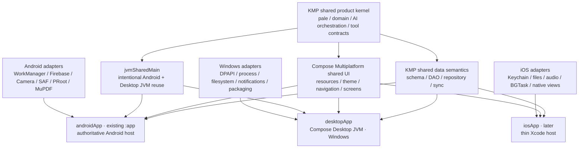

# RikkaHub Android-first 多平台产品架构

> 状态：已确认的长期产品与技术方向；分阶段实施依据
> 日期：2026-08-03
> 目标平台：Android（永久最高优先级）、Windows（近期目标）、iOS（后续目标）
> 核心决策：采用 Kotlin Multiplatform 共享产品内核，以 Compose Multiplatform 作为默认共享 UI，同时保留平台原生实现和 Android 超前能力的完整逃生口。

## 1. 文档地位

这份文档定义 RikkaHub 的长期多平台目标、不可破坏的架构原则、模块边界、迁移阶段和验收门槛。后续对话可以直接引用本文的工作包编号推进设计或实现。

本文不是一次性重写授权，也不要求当前 Android 代码立即迁移。它与现有架构文档的关系如下：

- [PALE6_FOUNDATION_ARCHITECTURE.md](./PALE6_FOUNDATION_ARCHITECTURE.md) 继续作为当前 pale.6、Room 演进、身份、同步、凭据与请求状态的权威设计。
- 本文规定这些产品能力未来如何进入多平台结构，不覆盖已经冻结的数据合同和迁移语义。
- 当前正在进行的 Room、ConversationStore、MediaAsset、RequestLedger 等工作应先按其既有门禁完成，不因多平台目标被中途改写。
- 每个实施阶段仍需独立确认基线、依赖版本、变更范围和验证结果；不得把本文解释成无限范围的仓库重构许可。

## 2. 执行结论

RikkaHub 采用以下组合，而不是在多个跨平台方案之间长期摇摆：

1. **Kotlin Multiplatform 是产品架构主干。** 会话、消息、助手、Provider 能力、AI 编排、工具协议、设置模型、同步协议和数据访问语义默认只有一份实现。
2. **Compose Multiplatform 是默认 UI。** 可稳定共享的主题、资源、导航、组件和页面只维护一份。
3. **Android `:app` 保持普通 Android application。** 它不转换成 KMP application，继续拥有 Android 生命周期、构建变体、Baseline Profile、Firebase、WorkManager、相机、Media3、SAF、通知、原生库以及最新 Android UI 能力。
4. **Windows 使用 Compose Desktop JVM。** 不以 Kotlin/Native Windows、Electron 或 Tauri 作为长期主客户端；优先复用 Kotlin/JVM、Ktor、OkHttp、文件系统、进程和现有宿主能力。
5. **iOS 后续使用薄 Xcode 宿主。** 默认复用共享内核和 Compose UI；Keychain、文件、音频、后台任务以及有明确体验收益的界面保留 Swift/UIKit/SwiftUI 实现。
6. **不追求 100% 代码共享。** 长期目标是共享约 80%–90% 的产品行为和大部分 UI，剩余代码是有意保留的平台能力，不是迁移失败。

一句话目标：

> 一套产品、一套领域真值、一套默认 UI，多个薄宿主；共享优先，但绝不为了共享牺牲 Android 的能力上限。

## 3. 为什么选择 KMP + Compose Multiplatform

### 3.1 与现有技术资产同方向

RikkaHub 已经以 Kotlin、coroutines、serialization 和 Jetpack Compose 为主，AI、搜索、会话、消息和高亮中也存在大量接近平台无关的代码。KMP 是在现有主代码上建立共享边界，而不是换语言、换 UI 范式或重新实现产品。

当前最适合逐步进入共享层的资产包括：

- `:pale` 中的稳定身份、状态机、同步 envelope 和纯 Kotlin 合同；
- `:ai` 中的 `UIMessage`、模型、Provider capability 和请求/响应协议；
- `:common` 中不依赖 Android 的 HTTP、缓存和通用工具；
- `:highlight` 的语法高亮模型与引擎；
- `:material3` 中的平台无关颜色算法；
- `:search` 中剥离 Compose 描述和 Android `Context` 后的搜索协议与网络实现。

### 3.2 Android-first 不等于 Android-only 架构

Android 永久最高优先级意味着：

- Android 可以首先获得新能力；
- Android 可以在公共 UI 尚未支持新 API 时使用 Android 专属实现；
- Android 的发布质量、性能和功能完整度是最高门禁；
- 其他平台暂不支持某能力时，使用明确的 capability 状态，而不是从公共模型中删除能力。

它不意味着把所有产品规则继续写入 `Context`、Activity、Compose 页面或 Android DI 图。产品规则越早从宿主中抽离，Android 自身也越容易演进和测试。

### 3.3 为什么不选择其他主路线

| 路线 | 结论 | 原因 |
| --- | --- | --- |
| KMP + Compose Multiplatform + 薄宿主 | **采用** | 最大化现有 Kotlin/Compose 资产复用，同时允许平台原生突破 |
| KMP 逻辑 + 三套完全独立 UI | 局部采用 | 适合少量平台关键体验，但长期维护成本过高，不作为默认策略 |
| 仅增加 Compose Desktop、暂不建立 KMP 边界 | 只允许作为迁移阶段 | 能较快得到 Windows 窗口，但会继续积累 Android/JVM 偶然耦合，不能成为终态 |
| Electron/Tauri 包装现有 `web-ui` | 不作为主客户端 | 会形成 Kotlin 与 TypeScript 两套模型、状态、交互和测试真值层；Web 保留为远程访问面 |
| Flutter / React Native / .NET MAUI 重写 | 不采用 | 重写成本高，既有 Kotlin/Compose 与 Android 原生能力损失最大，且不利于 Android-first |
| 追求所有平台 100% 相同 | 不采用 | 会把产品限制在最低公分母，并降低 Android 和桌面的体验上限 |

## 4. 目标架构



### 4.1 逻辑层次

#### Shared product kernel

公共产品核心包含：

- 稳定 ID、领域实体和序列化合同；
- 会话树、消息分支、引用和媒体逻辑身份；
- Assistant、Provider、模型 capability 与设置快照；
- generation、tool loop、审批、计费边界和恢复状态机；
- 搜索、MCP、Workspace 等能力的产品协议；
- 同步、冲突、备份和导入导出的业务语义；
- 与平台无关的错误分类、遥测事件和审计事件。

公共核心不得依赖 Android `Context`、Activity、URI、Room Android builder、Compose UI、平台文件路径、系统日志或具体 HTTP engine。

#### Shared data semantics

共享数据层负责：

- 当前 schema 的公共实体、DAO 和 Repository 行为；
- transaction、revision、CAS、outbox 和幂等规则；
- 新平台从当前 schema 创建数据库；
- 平台数据库 builder、路径、加密、历史迁移和特有索引由 adapter 提供。

Android 保留完整历史 Room migration 链。Windows 和 iOS 首次发布从当时的当前 schema 起步，不复制没有意义的 Android 历史迁移。

#### Shared UI

默认共享：

- Design tokens、主题、图标语义和 Compose resources；
- 通用组件及其 loading、empty、error、disabled、permission-required 状态；
- 会话列表、消息流、分支切换、Markdown、Provider/Assistant 配置等产品页面；
- Navigation route 模型和与平台无关的页面状态。

不强制共享：

- 文件/目录选择器、相机、系统分享、WebView；
- Android 最新或实验性 UI API；
- Windows 菜单、窗口、托盘、快捷键和拖放；
- iOS 上有明确产品收益的 SwiftUI/UIKit 页面；
- 权限、通知、后台执行和平台账户集成。

### 4.2 建议模块演进

不先进行大规模重命名。优先沿现有模块边界渐进转换：

| 当前模块 | 长期角色 | 首批动作 |
| --- | --- | --- |
| `:app` | Android 权威宿主 | 保持 Android application；逐步依赖共享模块 |
| `:pale` | KMP 产品基础内核 | 优先验证为 `commonMain`，维持当前依赖禁令 |
| `:ai` | KMP AI 协议与编排 | 把 UI、Android logging/file/context 和 HTTP engine 拆到 source set/adapter |
| `:common` | KMP foundation + 平台工具 | 将 `common/android` 留在 Android source set |
| `:search` | KMP 搜索协议/实现 | 从协议移除 `@Composable Description()` 与 `Context` |
| `:highlight` | KMP 高亮能力 | 分离纯引擎与 Compose 渲染适配 |
| `:material3` | KMP 颜色/设计工具 | 迁移平台无关算法 |
| `:speech` | 共享语音状态/Provider + 平台音频 | Android TTS/AudioRecord/Media3 留在 adapter |
| `:document` | 共享文档合同 + 平台引擎 | MuPDF JNI/Bitmap 保留 Android；为桌面选择 JVM/native adapter |
| `:workspace` | 共享 Workspace/tool 合同 + 平台 runtime | Android PRoot、Windows host process、iOS restricted 分开实现 |
| `:web` | Android/Windows JVM 可复用的远程访问面 | 分离 Ktor route 合同与 Android NSD/权限/宿主 |
| 新增 `:shared-ui` | Compose Multiplatform UI | 按页面迁入，不复制业务 ViewModel |
| 新增 `:desktopApp` | Windows JVM 宿主 | 只放生命周期、窗口、菜单、系统集成和 adapter wiring |
| 后续 `iosApp` | iOS 薄宿主 | 由 Xcode 管理签名、生命周期和 Apple 平台 adapter |

最终模块名可以在 MP-0 中根据 Gradle 约束微调，但上述依赖方向不得改变。

### 4.3 Source set 原则

建议公共模块使用以下层级：

```text
commonMain
├── jvmSharedMain
│   ├── androidMain
│   └── desktopMain
└── iosMain
```

- 新产品规则默认进入 `commonMain`。
- `jvmSharedMain` 只接纳有意复用于 Android 和 Windows 的 JVM 实现，例如部分 OkHttp/Ktor、Pebble、文件或服务端能力。
- `jvmSharedMain` 不能成为“暂时放不进 commonMain 的杂物层”；每个 JVM-only 依赖都要记录原因。
- 复杂能力优先使用 interface + adapter。`expect/actual` 只用于时钟、UUID、平台路径等极小原语，避免平台实现被隐藏在大量 actual 文件中。

## 5. 平台能力地图

| 能力 | 公共层 | Android | Windows | iOS（后续） |
| --- | --- | --- | --- | --- |
| 会话、分支、消息、Assistant | 完整共享 | 宿主接线 | 宿主接线 | 宿主接线 |
| Provider、流式响应、工具循环 | 编排与协议共享 | Android/JVM transport adapter | JVM transport adapter | Darwin transport adapter |
| Room 数据 | 当前 schema、DAO、Repository 语义共享 | 完整历史迁移、现有 FTS | 从当前 schema 起步、桌面 FTS | 从当前 schema 起步、iOS driver |
| 普通设置 | 模型和序列化共享 | Android DataStore path | Desktop DataStore path | iOS DataStore path |
| 密钥 | 只保存 `CredentialRef` | Android Keystore | DPAPI/Credential Locker | Keychain |
| 文件与附件 | `ResourceRef`、生命周期、媒体语义共享 | SAF/ContentResolver/Camera | 文件对话框、拖放、Explorer | UIDocumentPicker/Photos/Camera |
| 通知与后台执行 | 请求/任务状态机共享 | WorkManager/FGS/Notification | Desktop scheduler/tray/toast | BGTask/UserNotifications |
| 语音 | Provider、队列和状态共享 | AudioRecord/Media3/System TTS | Windows/JVM audio adapter | AVFoundation/Speech |
| 文档 | extractor/render 合同与结果模型共享 | MuPDF Android JNI | Desktop JVM/native engine | iOS PDFKit/native engine |
| Workspace | 文件与工具协议共享 | PRoot Linux runtime | Host process/PowerShell runtime | 明确受限或 unavailable |
| Web access | route/DTO/产品行为尽量共享 | Android Ktor + NSD | Desktop Ktor + LAN integration | 后续按需求决定 |

公共层应使用明确的能力状态，例如：

```text
Available
PermissionRequired
TemporarilyUnavailable
UnsupportedOnPlatform
RestrictedByPolicy
```

不得以异常、空值或删除入口来掩盖平台差异。

## 6. Android 上限保护合同

以下规则是采用 Compose Multiplatform 的前提，而不是可选优化：

1. Android 新功能不需要等待 Windows 或 iOS 同步完成才能发布。
2. 公共 UI 缺少最新 Android API 时，Android 可以提供完整的 `androidMain` 页面或组件实现。
3. Android-only 能力仍在公共领域模型中占有正式位置，其他平台通过 capability 表达支持状态。
4. 不为了公共编译而移除 Baseline Profile、WorkManager、Firebase、相机、Media3、SAF、PRoot、MuPDF 或 Android 专属性能优化。
5. Android 的冷启动、滚动、长会话、流式渲染、内存和耗电必须在迁移前记录基线；任何共享化阶段不得造成未经批准的回退。
6. Android release build 与关键 instrumentation/升级测试始终是合并和发布门禁。
7. 使用 alpha/snapshot Android UI 依赖时，先评估 Compose Multiplatform 对应版本；不兼容能力留在 Android，而不是降级整个应用。

## 7. 数据与迁移策略

数据库是高风险、后迁移工作流，不作为 KMP 骨架的第一步。

### 7.1 Android

- 保留全部历史 migration 和真实生产升级路径；
- 保留现有 custom SQLite、FTS、jieba/libsimple 等 Android builder 行为，直到替代实现有独立验证；
- 数据访问切换必须使用 reader/writer seam 或 shadow 验证，不进行一次性 destructive rewrite。

### 7.2 Windows 与 iOS

- 从首次发布时的当前 schema 建库；
- 不复制 Android 旧版本从未在该平台存在过的数据迁移；
- 从第一版开始采用共享稳定 ID、request ledger、asset/ref 和同步合同；
- 导入 Android 数据时走正式 backup/import protocol，不读取 Android 私有数据库实现细节。

### 7.3 搜索

全文搜索抽象为独立 `MessageSearchIndex`：

- Room 事务或 outbox 只提交需要索引的事实；
- Android、Windows、iOS 分别实现索引引擎；
- 索引可重建，不成为消息正文和引用关系的第二真值层。

## 8. Windows 产品目标

Windows 客户端不是“能打开的 Compose 窗口”，首个公开版本应当是完整可持续的垂直产品切片，至少包括：

- Provider、模型与 Assistant 配置；
- 会话创建、历史列表、分支、编辑/重生成；
- 流式输出、Markdown、代码高亮、表格、公式和引用；
- 图片/文件附件的桌面选择、拖放和持久化；
- 工具调用展示、审批、取消和恢复；
- Room/DataStore 持久化与系统安全凭据存储；
- 日志、崩溃诊断、更新和可安装的 `.msi`/`.exe`；
- Windows 键盘、鼠标、多栏、窗口尺寸和快捷键体验。

允许首版暂不具备 Android PRoot、系统 TTS 或所有媒体能力，但缺失项必须由正式 capability 表达，不能伪装成功或破坏共享数据。

## 9. 分阶段工作包

后续任务使用下列稳定编号，避免每次重新讨论总体方向。

| 编号 | 工作包 | 主要交付 | 完成门禁 |
| --- | --- | --- | --- |
| MP-0 | 架构护栏与版本矩阵 | 模块依赖图、Kotlin/AGP/CMP/Room/Koin/Ktor/Coil 兼容矩阵、性能基线、ADR | Android release/debug/test 基线可重复；无产品行为变化 |
| MP-1 | KMP foundation | 建立 KMP Gradle 骨架；优先迁移 `:pale`、纯模型、高亮/颜色算法；创建 `desktopApp` 空宿主 | Android APK 与现有测试不退化；Windows 可构建/打包；无复制领域模型 |
| MP-2 | Shared AI/search kernel | 清理 `Context`、Compose description、logging、file、secret 和 HTTP engine 耦合；共享 Provider/search/tool 编排 | 相同 fixture 在 Android/Windows 得到相同请求、状态迁移和错误分类 |
| MP-3 | Windows vertical slice | 交付完整桌面对话主链、设置、凭据、附件和持久化 | 可安装、可升级、可恢复；核心聊天不是演示壳 |
| MP-4 | Shared Compose UI | 按页面迁移 theme/resources/navigation/chat/settings；建立平台 slots | Android 体验不降级；Windows 具备桌面交互；不存在两套业务 ViewModel |
| MP-5 | Shared data | 共享当前 schema/DAO/Repository；拆 database builder、历史迁移和 SearchIndex | Android 生产升级验证通过；Windows fresh install/upgrade/backup round-trip 通过 |
| MP-6 | Advanced capabilities | speech、document、workspace、web、background task 的共享合同与平台 adapter | 每项能力至少有 Android + Windows 两个真实 adapter 或明确 unsupported 状态 |
| MP-7 | iOS host | Xcode 宿主、Apple adapters、共享 UI 接入和必要原生页面 | iOS 编译、签名、数据、凭据、附件、生命周期与核心会话链通过 |

### 阶段顺序规则

- MP-0、MP-1 必须先于后续工作。
- MP-2 与 MP-3 可以以小批次交错，但不能绕过共享合同直接在桌面复制业务逻辑。
- MP-5 必须等待当前 Android Room/Conversation/RequestLedger 主线稳定；数据库不得为了尽快出现桌面窗口而提前硬迁移。
- MP-6 按产品价值逐项推进，不要求一次完成所有 adapter。
- MP-7 在 Android + Windows 架构已经证明可扩展后启动。

## 10. 工程与 CI 门禁

### 10.1 每次迁移必须证明

1. Android 行为没有缺失，release/debug 仍可构建。
2. 被迁移的领域规则只剩一个权威实现。
3. 平台差异只存在于清晰命名的 adapter/source set 中。
4. Android 与 Windows 至少通过同一组公共 contract/fixture 测试。
5. 持久化、付费请求和有副作用工具的恢复语义没有弱化。
6. 新依赖不把平台 UI、Context、系统文件路径或 secret 泄漏回公共核心。

### 10.2 CI 目标矩阵

| Job | 内容 |
| --- | --- |
| Shared | common unit tests、serialization/schema compatibility、detekt/format |
| Android | assemble、JVM tests、lint、关键 instrumentation、升级迁移、Baseline Profile |
| Windows | desktop compile、unit/contract tests、安装包生成、启动与核心 UI smoke |
| iOS（MP-7 后） | framework compile/link、Xcode build、common tests、核心 UI/lifecycle smoke |

平台工具链无法运行时必须明确报告 blocker；不能用 common test 代替 Android instrumentation、Windows packaging 或 iOS build 的真实结果。

## 11. 禁止事项

- 禁止建立新的跨平台“大一统 god module”。
- 禁止把现有 `:app` 一次性转换或整体移动到 `commonMain`。
- 禁止复制 Conversation、UIMessage、Provider、RequestLedger、MediaAsset 或同步模型给 Windows/iOS。
- 禁止通过大量 `expect/actual` 隐藏复杂平台逻辑。
- 禁止让 `jvmSharedMain` 成为长期技术债缓冲区。
- 禁止先复制 Android 历史 migration，再思考新平台的数据策略。
- 禁止把 Web UI 包装成桌面主客户端后同时维护两套产品规则。
- 禁止为了共享率删除或降级 Android 专属能力。
- 禁止将“可以编译”描述成平台产品已经完成。

## 12. 决策检查清单

每个后续多平台任务开始前回答：

1. 这个能力属于产品规则、公共 UI、JVM 复用，还是平台宿主？
2. 当前权威实现和数据真值层在哪里？
3. Android 能否继续独立使用更高能力的实现？
4. 是否在无意中复制领域模型、状态机或数据迁移？
5. Windows/iOS 缺失该能力时，用户可见状态是什么？
6. 需要 interface + adapter，还是确实只是一个小型 `expect/actual` 原语？
7. 需要哪些 Android 与目标平台的真实验证，才能宣布完成？

如果无法回答其中任何一项，先补设计或 ADR，不直接开始跨平台搬运。

## 13. 成功定义

本路线完成时，RikkaHub 应具备：

- Android 继续是功能最完整、发布最优先的平台；
- Windows 是完整原生桌面体验，而不是网页壳或功能演示；
- iOS 可以在不重写产品核心的前提下接入；
- 会话、AI 编排、工具、数据、同步和主要 UI 只存在一份权威实现；
- 平台专属能力独立、明确、可替换，不污染公共核心；
- 新产品能力可以先在 Android 落地，再自然进入共享层和其他平台；
- 项目上限由产品设计决定，而不是由最低能力平台或跨平台框架限制。

## 14. 官方参考与版本刷新规则

本决策基于 2026-08-03 可用的官方资料：

- [Android Developers：Kotlin Multiplatform](https://developer.android.com/kotlin/multiplatform)
- [Android Developers：Android-KMP library plugin](https://developer.android.com/kotlin/multiplatform/plugin)
- [JetBrains：从 Android 迁移到 Kotlin Multiplatform](https://kotlinlang.org/docs/multiplatform/migrate-from-android.html)
- [JetBrains：Compose Multiplatform 兼容性与版本](https://kotlinlang.org/docs/multiplatform/compose-compatibility-and-versioning.html)
- [JetBrains：Compose Desktop native distributions](https://kotlinlang.org/docs/multiplatform/compose-native-distribution.html)
- [Android Developers：Room KMP](https://developer.android.com/kotlin/multiplatform/room)
- [Android Developers：DataStore KMP](https://developer.android.com/kotlin/multiplatform/datastore)
- [Ktor：Client engines](https://ktor.io/docs/client-engines.html)
- [Koin：Kotlin Multiplatform setup](https://insert-koin.io/docs/reference/koin-core/kmp-setup/)
- [Coil：Upgrading to Coil 3](https://coil-kt.github.io/coil/upgrading_to_coil3/)

MP-0 和每个主要阶段开始前必须重新核对官方兼容矩阵。本文的产品原则和依赖方向是长期合同；具体库版本、最低系统版本和 experimental API 状态不是永久冻结值。
