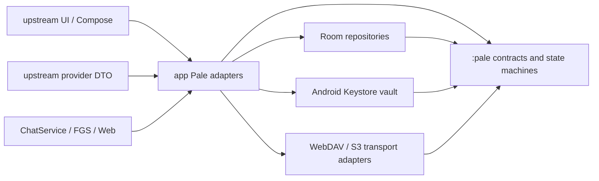
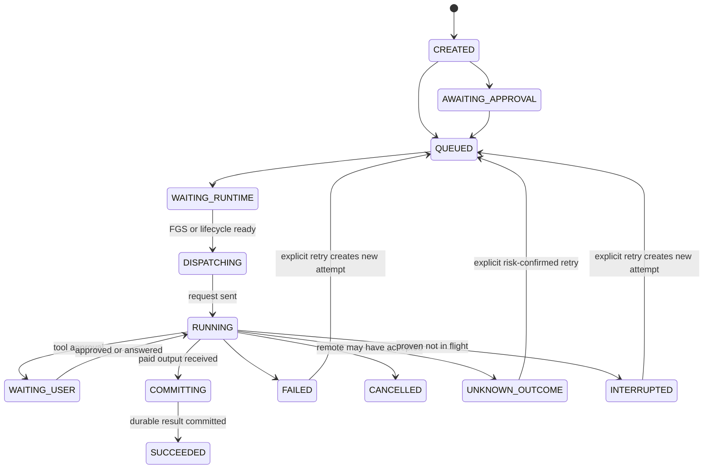

# PaleInk pale.6 基座架构

> 状态：已获准实施；架构冻结版 v1（2026-08-02）
> 基线：`v2.4.5-pale.4` / Room 26 / update feed v2
> 目标：pale.6 成为长期维护基座；pale.5 仅作为不公开的迁移开发阶段，不创建公开 tag、Release 或更新 feed。

## 1. 结论

pale.6 不以继续向现有类追加字段为主，而是建立一条可持续演进的主干：稳定身份、逻辑资产与物理副本分离、逐记录会话存储、统一请求账本、设备密钥保护的凭据库、带条件写入的增量同步，以及一等引用模型。

采用一个新增的 Fork 自有 `:pale` 核心模块承载稳定 ID、状态机、同步 envelope 和纯 Kotlin 合同；Room、Android Keystore、Provider DTO、Compose 与现有服务留在 `:app` / `:ai` 的适配层。新核心模块不依赖 `:app` 或 `:ai`，从而避免 Fork 业务继续横穿 upstream 高频修改区。

## 2. 不可破坏的原则

1. 数字 Room 主键、文件路径、数组下标、Provider `tool_call_id` 和远端 object key 都不是业务身份。
2. 新记录使用小写 UUID；历史 `legacy-*` ID 永久兼容，不因迁移或同步重写。
3. 消息只引用逻辑 `assetId`；本地路径、外部 URI、远端对象是可替换的 replica。
4. 已发送的付费请求不会因进程恢复、空输出、网络断开或状态未知而自动重放。
5. 运行态只能有一个权威状态源。UI、通知和后台服务投影权威状态，不自行维护第二套状态机。
6. 同步只处理可合并业务记录和加密/内容寻址的 blob；凭据明文、运行中的请求和设备私有权限默认不同步。
7. 每次 schema/file-format/request-state 变更只有一个版本跃迁、一个迁移、一个独立提交和一组迁移/故障注入测试。
8. 不使用 destructive migration；无法证明安全迁移时中止打开并保留原数据。

## 3. Fork boundary



依赖规则：

- `:pale` 可以依赖 Kotlin、coroutines、serialization；不得依赖 `:app`、`:ai`、Compose、Room 或具体 Provider。
- `:ai` 不依赖 `:pale`。Provider 继续输出 `UIMessage`，由 App adapter 写入 pale 数据合同。
- Fork 新业务默认进入 `:pale` 或 `app/.../fork/pale/`；直接修改 upstream 文件必须登记为 integration touchpoint。
- `ops/fork-boundary/` 保存 upstream baseline、Fork-owned roots 和 touchpoint 清单；CI/Release 对未登记的新跨界修改失败。
- upstream 同步只允许在独立提交中更新 baseline/touchpoint，禁止和功能提交混在一起。

## 4. 稳定身份合同

| 领域 | 稳定 ID | 当前来源 | pale.6 规则 |
|---|---|---|---|
| Conversation | `conversationId` | 已有 UUID | 永不因导入、重命名或移动文件夹改变 |
| MessageNode | `(conversationId, nodeId)` | 已有 UUID，但仅保证会话内稳定 | 顺序由 `node_index/order_key` 表达，ID 不含顺序；数据库使用复合身份 |
| Message | `(conversationId, messageId)` | 已有 UUID，但 Fork/导入可跨会话重复 | 分支切换不复制身份；Fork 新建 messageId 并记录来源会话/消息复合身份 |
| MessagePart | `(conversationId, partId)` | v28 新增 | 新值随机 UUID；旧数据的确定性 ID 必须包含 conversationId |
| MediaAsset | `assetId` | v26 已有 String | 新值为 UUID；`legacy-*` 原样保留 |
| ManagedFile | `fileId` | v27 新增 | 本机受管理文件身份；路径可变 |
| MediaReplica | `replicaId` | v27 新增 | 一条物理/远端副本一 ID |
| Request | `requestId` | 部分链路已有 | 一次用户意图；重试不换 requestId |
| RequestAttempt | `attemptId` | v29 新增 | 每次实际网络发送唯一；携带独立 idempotency key |
| ToolInvocation | `invocationId` | v29 新增 | 与 Provider toolCallId 分离；恢复按 invocationId 判定 |
| Credential | `credentialId` | vault v1 新增 | DataStore 只保存 `vault:v1:<id>` 引用 |
| Replica/Device | `replicaId` | Sync v2 新增 | 每次安装生成；恢复备份不克隆设备身份 |
| Sync operation | `operationId` | Sync v2 新增 | immutable envelope 与 outbox 幂等键 |
| Citation/Source | `citationId/sourceId` | v31 新增 | 引用实例与来源记录分离 |

所有 ID 入库前执行非空、长度和字符集校验。新 ID 不包含用户文本、路径、Provider key 或设备硬件标识。

## 5. 版本与迁移序列

| 版本 | 交付项 | 主要持久化变化 |
|---|---|---|
| Room 26 | pale.4 基线 | MediaAsset v1、`message_node.messages` JSON |
| Room 27 | MediaAsset v2 | `managed_files.file_id`、`media_asset_replica`、通用媒体/隐私/保留字段 |
| Room 28 | ConversationStore v2 | 每 node 元数据 + 每 message payload；删除节点级整组消息 blob |
| Room 29 | RequestLedger / 工具权限 | request、attempt、tool invocation、permission、audit event 表 |
| Vault file v1 / Preferences v4 | Credential Vault | DataStore 密文引用；Keystore AES-GCM envelope；不占 Room 版本 |
| Room 30 / Sync protocol v2 | Sync v2 | replica、record head、outbox、conflict；远端 immutable records/blobs |
| Room 31 | Citation | source 与 message citation 关系表；旧 UrlCitation/Markdown marker 迁移 |

迁移必须支持 `26→27→28→29→30→31` 连续升级；Release 还要覆盖从 pale.3/pale.4 生产数据原位升级到 31。每步先验证旧行，再建新结构、复制、验证计数/引用，最后才删除旧结构。

## 6. MediaAsset v2（Room 27）

在 v27 前先完成三个不改 schema 的 P0 safety gate：

- 删除/裁剪会话只释放经过 canonical 校验、已登记且允许随会话回收的附件；永不删除 `images/`、`chat_generated_images/` 中的图库原图。
- 裸 `file://`、受管根之外或数据库未登记的路径不能触发物理删除。
- WebDAV/S3 的 FILES 备份和恢复必须包含两类生成图片目录，并以 hash manifest 验证 fresh-install 恢复完整性。

v2 使用三层模型：逻辑 asset、不可变 blob、可替换 replica。`GenMediaEntity` 在本轮保留物理表名以降低升级风险；现有 `path` / `managed_file_id` 只是 v1 兼容投影。

新增/扩展：

- `managed_files`：增加稳定 `file_id`；`REPLACE` 改为冲突拒绝 + 显式 update，不能改变已有行身份。
- `GenMediaEntity`：增加 `media_kind`、`display_name`、`lifecycle`、`privacy_scope`、`retention_policy`、`deleted_at`。
- `media_blob`：`blob_id`、sha256、MIME、字节、尺寸/时长、storage state；内容不可变并允许多个 asset 共享。
- `media_asset_blob`：asset/blob/role（original/preview/thumbnail/transcode）多对多关系。
- `media_replica`：`replica_id`、`blob_id`、kind、managed file/remote locator、etag、state、encrypted、验证时间。
- `media_relation`：有序 `EDIT_OF / DERIVED_FROM / REFERENCE_INPUT`，替代只能记录单父的 `parent_asset_id`。
- `message_media_ref`：conversation/message/part/asset 的显式引用，是删除、Fork、同步和 GC 的权威。
- `media_migration_journal`：按 conversation/file 记录 backfill 与惰性文件迁移进度。

核心约束：

- blob 是不可变内容；编辑永远产生新 asset，多个参考图全部形成有序 relation。
- 一个 blob 可有多个 replica；`managed_file_id` 唯一绑定一个 local replica，remote locator 只出现在 remote replica。
- `available` 必须通过大小/hash/容器探测；缺文件只改变 replica state，不删除 asset 或消息引用。
- 删除消息只删除 `message_media_ref`。图库 asset 只有在用户显式删除、所有消息/任务/分享/关系引用释放且同步 tombstone 已确认后才进入 GC。
- Image/Video/Audio/Document 均可携带 `assetId`；Provider materializer 在发送前把 asset 转为 file/stream/base64/remote URL，Provider DTO 不直接读取 Room。

Room 26→27 只建表并复制可证明的关系，不在 SQL migration 中读取/移动大文件。历史 `managed_files.id` 生成 `legacy-managed-file-<id>`；现有 assetId 原样保留。post-open worker 按 journal 扫描所有消息分支及 Tool output/progress，为普通附件/MCP/Workspace/原生模型媒体补 asset/ref；文件先惰性指向旧目录，验证 SHA 后再原子迁到 `files/media/blobs/sha256/...`。至少一个开发阶段双写 v1 compatibility projection 与 v2，并持续对账。

## 7. ConversationStore v2（Room 28）

当前 `MessageNode[] + selectIndex` 只是“按位置分组的备选消息”，不保存真实父子边，可能拼出不同分支的混合上下文。v2 建立真实消息树：

- `conversation`：增加 `revision`、`active_leaf_message_id`、`storage_version`、`deleted_at`、`last_writer_replica_id`。
- `message`：`conversation_id + message_id` 复合主键、同会话 parent、`branch_group_id`、`origin_conversation_id + origin_message_id`、request、role、draft/streaming/completed/interrupted/failed、model/provider response ID、时间戳、revision。不能假设 UIMessage ID 全局唯一：旧 Fork 会复用 ID，Chatbox 导入也可能跨会话碰撞。
- `message_part`：稳定 `part_id`、message、ordinal、kind、schema version、payload JSON、asset/tool invocation ID。
- `conversation_migration_journal`：legacy digest、阶段、游标、错误与推断标志。
- FTS 改为同事务 outbox + 幂等 worker，不能在 Room commit 后无保护地先删再重建。

`conversation.active_leaf_message_id` 是当前分支唯一真值，当前上下文沿同一 conversation 的 parent 链推导。已完成消息/part 不原地改写；edit/regenerate 创建 sibling，Fork 为 conversation/message/part 全部生成新 ID，并明确 `origin_conversation_id + origin_message_id`。所有 mutation 使用 `WHERE revision = expectedRevision` 的 CAS；进程内 Mutex 只是优化，Room revision 才能防止 Chat/Web/标题/建议/文件夹并发互相覆盖。

26/27 的旧结构无法恢复真实历史父边：迁移按当时选中路径推断 parent，旧 node ID 作为 branch group；旧 UIMessage ID 在同一会话内唯一时保留，重复/非法 ID 才按 conversation/node/ordinal/payload digest 派生并标记 `legacy_inferred`。旧 part ID 以 conversation ID + message ID + ordinal + kind + canonical payload digest 确定性生成。非法 JSON、未知 part 或 selectIndex 越界进入 quarantine/只读恢复，不能静默丢弃，也不能因一条损坏删除整场会话。

迁移先 additive shadow tables + 可重入 backfill/聚合 digest 对账，验证后再把 reader 切到 v2；停止旧 JSON 双写必须晚于完整迁移与真机升级验证。

## 8. RequestLedger 与工具权限（Room 29）



表：

- `request_ledger`：用户意图、parent/group request、conversation/message/part/provider/model/API surface、输入 hash、状态、lease/fencing epoch、billable boundary、token/usage、错误分类和时间戳。
- `request_attempt`：每次网络发送的 `attempt_id`、ordinal、唯一 idempotency key、transport/remote request ID、sent/ack/first-byte/result-committed 时间。
- `request_output`：request 与 message/part/asset/source 的显式提交关系。
- `tool_invocation`：host `invocation_id`、Provider toolCallId、工具名/schema hash、输入 hash、审批、执行状态、结果 hash。
- `tool_permission`：server/tool/action/schema hash、allow/ask/deny、once/conversation/assistant/global scope、约束与过期时间。
- `tool_audit_event`：append-only 决策/执行事件，只保存脱敏摘要和 hash，不保存 API key、完整文件或剪贴板正文。

创建 request 时冻结实际 `CapabilitySnapshot`、resolver/schema 版本和来源，UI 与 Provider encoder 使用同一份快照。`billable_boundary` 至少区分 `not_sent / sent / response_started / result_committed / unknown`；远端可能已受理但本地没有回执时进入 `UNKNOWN_OUTCOME`，没有 Provider 幂等保证就必须提示可能重复计费并由用户确认。

`COMMITTING` 表示付费输出已经到达，只允许向前补文件/Room/message/citation，禁止再次调用 Provider。普通模型、标题/建议、MCP/Workspace/本地工具与图片都必须进入同一 ledger；图片多图是 group request + 每槽 child request。

图片 SharedPreferences durable records 在首次 v29 启动导入：终态保留为历史；可证明尚未 dispatch 的 queued 记录转 `INTERRUPTED`，旧 `RUNNING` 因无法证明远端未受理，一律转 `UNKNOWN_OUTCOME`；已有完整输出的记录从 `COMMITTING` 只向前做 Media reconcile，绝不重新调用 Provider。导入完成后写迁移标志，旧存储只读一个版本后删除。

通用“重试”不能只看终态。`FAILED/INTERRUPTED` 只有在 `billable_boundary=NOT_SENT` 时才允许无风险新 attempt；`SENT/RESPONSE_STARTED/RESULT_RECEIVED/UNKNOWN` 均需要 Provider 明确幂等保证或用户确认可能重复计费。`COMMITTING` 即使进程重启也保持本地恢复态，失败只能重做文件/Room/message/citation 提交，不能退回网络队列。

FGS、通知、聊天计时、任务中心和工具 UI 都观察 ledger projection。不得再从 Compose 本地计时或 Tool.output 是否为空推导权威状态。

## 9. Credential Vault（Vault v1 / Preferences v4）

- Android Keystore 生成不可导出的 wrapping key；每个 credential 使用独立 DEK 和 `AES/GCM/NoPadding` envelope，AAD 固定包含 schema、credentialId、kind、owner/slot 与 revision。
- vault payload 使用带 magic/version/nonce/GCM tag 的 envelope，写同目录临时文件、fsync、自解密验证后原子替换；目录位于 `noBackupFilesDir`。
- DataStore 中 Provider、搜索、TTS/ASR、MCP OAuth/header、Web、WebDAV 和 S3 的秘密值替换为 `vault:v1:<credentialId>`。
- 地址由 namespace + owner stable ID + field slot 形成；列表重排不产生新 credential。自定义 Header/Body、MCP Pair 等 `{name/key,value}` 结构按语义识别秘密，不能只检查 JSON 属性名。
- legacy→ref 迁移使用 journal 和 `PREPARE → ENVELOPE_VERIFIED → REFERENCES_WRITTEN → LEGACY_CLEARED`，双读可重入；OAuth token refresh 以 vault revision CAS 更新。
- 运行时 Settings 是解密后的内存投影；持久化和日志只能看到引用。Keystore 失效时进入 locked 状态并要求重新输入，不能静默清空密文。
- 普通备份/Sync v2 不带 vault。未来若允许跨设备秘密迁移，必须是用户显式操作的 passphrase + memory-hard KDF + AEAD 包，不复用设备 Keystore key。

实现以 Android 官方 [Cryptography](https://developer.android.com/privacy-and-security/cryptography) 和 [Android Keystore](https://developer.android.com/privacy-and-security/keystore) 建议为边界。

## 10. Sync v2（Room 30 / protocol v2）

当前 WebDAV/S3 ZIP 保留为“备份/灾难恢复”，不再被称为同步。Sync v2 共用一个 `ObjectSyncTransport`；WebDAV 与 S3 只实现传输，不复制业务合并逻辑。协议避免所有设备竞争同一个 central manifest：每台设备只追加自己的 immutable operation segment 并更新自己的 head。

本地表：

- `sync_replica`：本安装 replica/device ID、durable monotonic counter、HLC、acknowledged version vector、last successful sync。
- `sync_record_head`：entity type/id、dotted version、writer replica、payload hash、tombstone、causal state。
- `sync_outbox`：immutable operation envelope、重试次数、next attempt、状态。
- `sync_conflict`：双方 head、分类、可自动合并/需用户处理状态。

远端布局：

```text
rikkahub-sync/v2/<spaceId>/
  ops/<deviceId>/<sequence>.json.enc
  heads/<deviceId>.json.enc
  blobs/<keyed-content-hash>.enc
  snapshots/<generation>.json.enc
```

operation ID 为 `(deviceId, monotonic counter)`，携带 entity type/id、dotted version、HLC、tombstone、payload/blob hash。operation/head/snapshot 使用严格 canonical JSON，经重新编码一致性检查后再加密；本地 outbox 以 `envelope_bytes` 保存，避免列名把未来格式迁移绑定到伪 CBOR。先上传 immutable op/blob，再条件更新本设备 head；`If-None-Match` 防止重复 sequence，`If-Match` 防止同设备并发 owner。S3 官方支持 [conditional writes](https://docs.aws.amazon.com/AmazonS3/latest/userguide/conditional-writes.html)，WebDAV 使用 RFC 4918/HTTP 条件请求。传输不满足 immutable create/可靠读取时 fail closed，保留快照备份而不伪装成同步。

因果关系由 version vector/dotted version 判断，HLC 只负责确定性排序，不能代替因果。scalar 在确认并发后 field-level LWW（HLC + device ID tie-break）；stable-ID list 用 OR-set + order key；conversation/message 合并为分支；同路径文件保留 conflict copy；delete 对 concurrent edit 进入可恢复 trash/conflict。tombstone 仅在所有未撤销设备的 acknowledged vector 都支配 delete 后 GC。全量 restore 必须创建新 sync epoch/space，不能把旧快照静默覆盖云端新状态。

active request、设备私有 permission 和 vault secret 不同步；credential 冲突不自动 LWW。未来可选的 E2EE vault 是独立协议，不进入普通 Sync v2。

## 11. Citation（Room 31）

- `citation_source`：`source_id`、canonical URL、title、publisher、retrieved_at、snippet/content hash、metadata。
- `message_citation`：`citation_id`、`message_id`、`source_id`、ordinal、text start/end、quote、provenance（provider/search/tool/import）、provider metadata。
- `UIMessageAnnotation.UrlCitation` 升级为带稳定 citation/source ID 的兼容 DTO；旧 title/url 自动映射。
- Search tool 返回结构化 source，不再只靠 prompt 要求模型输出 `[citation,domain](id)`；Markdown marker 保留为旧消息解析兼容层。
- UI、分享、导出、Web DTO 与 Sync v2 使用同一引用记录；缺来源时显示“来源不可用”，不让序号错配到另一 URL。

## 12. 验证与发布硬门槛

每一阶段必须：

1. 纯状态机/序列化/仓储单测；新迁移的 `MigrationTestHelper` 数据断言。
2. `git diff --check`、全模块 `test`、`lint`、Debug/Release 构建。
3. 16 KB Android 17 emulator 执行当前版本单步迁移和 26→latest 全链迁移。
4. 故障注入覆盖：DB commit 前后、文件 rename 前后、进程死亡、网络 first-byte 后断开、manifest 条件写冲突、vault 文件截断/Keystore locked。
5. 同包名、同永久签名真机从 pale.4 原位升级；检查历史图片、长会话、工具中断、凭据、备份/恢复、同步冲突、引用、后台通知和重复计费边界。
6. 真机性能基线覆盖冷启动、500 nodes、10 张 4K 图、30 秒 Markdown stream、后台双图；记录 p50/p95 frame、PSS/GC、ANR、网络和耗电。

Room 官方建议保存 schema 并测试完整迁移链，见 [Migrate your Room database](https://developer.android.com/training/data-storage/room/migrating-db-versions)。没有设备/模拟器结果时只能标记“编译通过”，不能标记迁移通过。

## 13. 独立提交顺序

1. `fix(chat): make image gallery scrolling responsive`（已完成：`dd096797`）
2. `docs/architecture + build: establish pale fork boundary`
3. `feat(media): introduce MediaAsset v2 replicas`（Room 27）
4. `refactor(conversation): migrate to ConversationStore v2`（Room 28）
5. `feat(ledger): unify requests and tool permissions`（Room 29）
6. `feat(security): move credentials into device vault`（Preferences 4 / Vault 1）
7. `feat(sync): add immutable operation-log Sync v2`（Room 30）
8. `feat(citation): persist structured sources`（Room 31）
9. `perf/quality/test`: 性能、P3-Q、APK、upstream radar、故障注入独立提交
10. `release: v2.4.5-pale.6`

每个提交后更新 `docs/audit/PROJECT_HEALTH_AUDIT.md` 对应状态和验证证据。若某阶段无法满足迁移或真机门槛，后续代码可以继续开发，但不得发布 pale.6。
