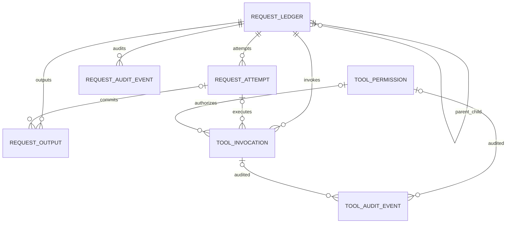

# Room 29 RequestLedger / 工具权限冻结合同

> 状态：已获准实施；Room 29 canonical contract v1  
> 更新时间：2026-08-03  
> 上位合同：`PALE6_FOUNDATION_ARCHITECTURE.md` §8  
> 范围：请求、尝试、输出、工具调用、权限、审计与旧状态迁移；不包含 Credential Vault、Sync v2 或 Citation 表。

## 1. 结论

Room 29 建立唯一的请求与工具执行真值层。聊天、标题、建议、翻译、图片、MCP、Workspace、前台服务、通知和 Compose 只能创建请求或投影账本，不再各自维护可恢复状态机。

本合同取代此前四表草稿。Room 29 一次性冻结以下八张表：

| 表 | 权威事实 |
| --- | --- |
| `request_ledger` | 一次用户意图或内部子请求的当前状态、计费边界、来源、能力快照和 owner fencing |
| `request_attempt` | 每次真实外部派发；重试新增 attempt，不覆盖旧证据 |
| `request_output` | request/attempt 到 message、part、asset、source 的已提交输出 |
| `tool_invocation` | host invocation 身份、Provider toolCallId、schema/input digest、审批和执行状态 |
| `tool_permission` | 当前有效的 allow/ask/deny 策略及 scope、schema、约束、版本和失效时间 |
| `request_audit_event` | request 状态、派发、计费、恢复的追加式证据流 |
| `tool_audit_event` | 工具发现、审批、授权、撤销、执行的脱敏追加式证据流 |
| `request_migration_journal` | 旧图片任务、message tool、Workspace/MCP 权限的可恢复、可校验导入进度 |

Room 28→29 只创建完整 schema、索引和 journal，不读取或改写 SharedPreferences、Conversation、Media、Workspace 或 MCP 配置。旧数据导入是 post-open、可重入、保留原源的独立阶段。

## 2. 不可破坏的原则

1. `request_id` 表示一次意图；每次网络发送使用新的 `attempt_id` 和幂等键。
2. Provider `toolCallId` 不是 host 身份；每次工具调用使用新的 `invocation_id`。
3. `intent_key` 是非空 canonical dedupe key；不得依靠含 NULL 的复合 UNIQUE 防重复派发。
4. `CapabilitySnapshot`、provider/model/API surface、完整工具 catalog/schema digest 在 request 创建时冻结，之后只读。
5. `BillableBoundary` 单调前进；已发送或结果未知的请求不得自动重放。
6. `COMMITTING` 只允许补本地文件、Room、message、media、citation，不得再次调用 Provider 或外部工具。
7. request/attempt 状态更新必须使用 `expected_state + state_revision + fencing_epoch` CAS，并与 audit event 同一事务提交。
8. 同一 request 同时最多一个 active attempt；旧 attempt 永久保留。
9. request、attempt、output、audit 不因 Conversation、Message 或 Media 删除而消失；只保存逻辑锚点，不建立级联外键。
10. audit payload 只保存脱敏摘要、大小、分类和 hash；禁止保存 API key、OAuth token、完整命令、文件正文、剪贴板正文或 Provider 敏感参数。
11. 迁移无法证明时进入 `quarantined`/incomplete，保留旧源，不猜测成功或失败。
12. UI、通知、FGS、任务中心只观察 ledger projection，不从页面计时、Tool.output 或进程内 Flow 推导权威状态。

## 3. 稳定身份与父子关系



- 普通聊天：root request 表示用户 turn；每个实际模型 step 可用 child request 表示。
- 图片多图：group root 表示一次用户意图；每个槽是 child request，因为每槽会产生独立 Provider 计费，而不是同一 request 的 retry attempt。
- 工具调用：工具 child request + `tool_invocation`；Provider toolCallId 只作为协议映射字段。
- 显式 regenerate/edit 产生新的 request，不复用旧成功 request。
- 对失败、中断或未知结果的风险确认重试，在同一 request 下新增 attempt；`SUCCEEDED` 与 `CANCELLED` 不重开。

新 ID 使用小写 UUID。历史 `legacy-*` 原样保留。所有 ID 在仓储边界执行字符集和长度校验。

## 4. 状态与计费合同

### 4.1 RequestState

```text
CREATED
  -> AWAITING_APPROVAL -> QUEUED
  -> QUEUED -> WAITING_RUNTIME -> DISPATCHING -> RUNNING
  -> RUNNING -> WAITING_USER -> RUNNING
  -> RUNNING -> COMMITTING -> SUCCEEDED
```

附加非活跃状态：`FAILED`、`CANCELLED`、`INTERRUPTED`、`UNKNOWN_OUTCOME`。

- `FAILED` / `INTERRUPTED`：只有 `NOT_SENT` 可无风险创建新 attempt；否则需要 Provider 幂等保证或用户确认可能重复计费。
- `UNKNOWN_OUTCOME`：禁止自动回到队列；仅允许远端核对、本地证据恢复，或用户明确接受风险后创建新 attempt。
- `COMMITTING`：付费或有副作用的输出已经存在，只做本地幂等修复。
- `SUCCEEDED`：至少存在一条已提交 `request_output`；无输出的成功仅允许显式声明 `output_kind=none`。

### 4.2 AttemptState

```text
PREPARED -> DISPATCHING -> RUNNING -> COMMITTING -> SUCCEEDED
```

附加终态：`FAILED`、`CANCELLED`、`INTERRUPTED`、`UNKNOWN_OUTCOME`。attempt 终态不可重开。

### 4.3 BillableBoundary

```text
NOT_SENT < SENT < RESPONSE_STARTED < RESULT_RECEIVED < RESULT_COMMITTED
```

`UNKNOWN` 表示远端可能已经受理但本地无法证明具体阶段。任何已知状态可进入 `UNKNOWN`；`UNKNOWN` 不得降回已知阶段，除非由远端或本地证据执行一次显式 reconcile，并产生 audit event。

- 启动 FGS、创建通知、插入占位卡片、进入 `DISPATCHING` 都不是 `SENT`。
- `SENT` 必须在 Provider transport 或 tool executor 真正交出请求时记录。
- 首字节或流首块到达记录 `RESPONSE_STARTED`。
- 完整结果字节/结构已经可本地提交时记录 `RESULT_RECEIVED` 并进入 `COMMITTING`。
- 文件、Room、message/media/output 关系全部提交后记录 `RESULT_COMMITTED` 和 `SUCCEEDED`。

## 5. Schema 冻结

### 5.1 `request_ledger`

必须包含：

- identity：`request_id`、唯一 `intent_key`、`parent_request_id`、`request_kind`；
- source anchors：conversation/assistant/message/part、legacy node/message/request、workspace、MCP server、未来 credential ref；
- execution snapshot：provider kind/id、model、API surface、input digest、CapabilitySnapshot JSON、resolver version、tool catalog digest；
- state：approval、request、billable、attempt count、active attempt；
- ownership：lease owner/until、fencing epoch、state revision；
- evidence：billable/dispatch/terminal 时间、remote request/response、usage、分类错误和 unknown reason。

`parent_request_id` 删除时 SET NULL；Conversation/Message/Part 不建 FK，避免用户删除内容时抹掉计费与审计证据。

### 5.2 `request_attempt`

必须包含稳定 attempt ID、request FK、单调 ordinal、全局唯一 idempotency key、state/billing、transport、request fingerprint、owner replica、FGS task、remote IDs、prepared/sent/ack/first-byte/result/commit/finished 时间、checkpoint digest、attempt usage/error 和 state revision。

### 5.3 `request_output`

显式记录 output ID、request、可选 attempt、kind、ordinal、conversation/message/part、asset/source、content digest 和 committed time。一个 request 可提交多个图片、message part 或 citation source。

### 5.4 `tool_invocation`

必须包含 host invocation ID、request/attempt、Provider toolCallId、server/tool、principal/action、schema/input digest、side-effect class、approval/execution state、permission ID、result digest、分类错误和时间。

审批与执行前都必须重新核对 server/tool/schema/scope fingerprint。schema 改变会使旧 permission 失效并产生 audit，不能静默沿用。

### 5.5 `tool_permission`

使用唯一 `permission_key` 规范化 principal、server/tool/action、schema digest、scope 和 constraints。decision 为 `allow/ask/deny/revoked/expired`；scope 为 `once/conversation/assistant/workspace/server/global`。

Workspace 的旧布尔 `needsApproval` 只能映射为 `ask/allow` 策略，不能解释成“用户已经批准本次执行”。

### 5.6 Audit

- `request_audit_event` 的 `(request_id,event_seq)` 唯一且单调；状态变更与对应 event 同事务提交。
- `tool_audit_event` 允许没有 request，但 request/invocation/permission 至少一个锚点存在，由 repository 校验。
- audit 不提供当前态查询，当前态只来自 ledger/invocation/permission。

### 5.7 `request_migration_journal`

以 `(source_kind,source_id)` 唯一，保存 phase、source digest、expected/migrated count、cursor/checkpoint、legacy-retained、attempts、错误、lease/fencing 和完成时间。

推荐 phase：`pending -> scanning -> importing -> verifying -> complete`，附加 `quarantined`。只有 `complete` 且 digest/count 对账后，旧源才进入只读；至少保留一个发布版本。

## 6. 旧数据迁移规则

28→29 SQL migration 不导入旧运行态。post-open importer 按来源分批处理：

1. 图片 SharedPreferences durable records；
2. ConversationStore v2 中 message request/tool 锚点；
3. Workspace `tool_approvals`；
4. MCP tool schema/needsApproval 配置；
5. MediaAsset 与生成 request 的关系。

图片旧状态保守映射：

| 旧证据 | Room 29 |
| --- | --- |
| 可证明未派发的 QUEUED | `INTERRUPTED / NOT_SENT` |
| 旧 RUNNING、无最终结果证据 | `UNKNOWN_OUTCOME / UNKNOWN` |
| 预留或最终文件存在、关系未完成 | `COMMITTING / RESULT_RECEIVED`，仅本地修复 |
| 完整文件、Media、message/output 关系存在 | `SUCCEEDED / RESULT_COMMITTED` |
| 无法解析 | journal `quarantined`，保留原记录 |

旧 store 在 importer 完成前不得删除不可解析记录，也不得在初始化时清空 standalone key。迁移完成后旧 store 只读一个版本，再由独立迁移删除。

## 7. 生产接入顺序

1. 纯 `:pale` 状态机、billing monotonicity、retry policy 和 canonical fingerprint。
2. Room 28→29 完整 schema、DAO、journal、29 schema export 和迁移测试；不接业务。
3. transactional repository：create/claim/transition/audit/output commit、lease/fencing、恢复查询。
4. disabled dispatch gate：Provider、image、MCP、Workspace 的 pre-dispatch/SENT/result/commit adapter。
5. 主聊天、标题、建议、翻译接入；冻结同一份 `RequestExecutionPlan` 给 ledger 与 Provider encoder。
6. host tool invocation、审批 CAS、permission/audit 接管；UIMessage Tool 退化为 projection。
7. 图片 group/slot child request、SharedPreferences importer、FGS/通知/Gallery projection 接管。
8. 启动 reconcile、任务中心和可观测性；故障注入通过后启用 gate。

任何生产接入必须保证：PREPARED/ledger 写入失败时绝不派发；跨过 SENT 后即使 UI/message 保存失败，也绝不自动重放。

## 8. 故障注入门槛

- ledger commit 前崩溃：无网络请求，可安全重新创建。
- `DISPATCHING` 交出请求前崩溃：`NOT_SENT`，可显式重试。
- 请求交出后、SENT commit 前崩溃：`UNKNOWN_OUTCOME`，禁止自动重放。
- first-byte 后断开：保留 attempt、usage/remote ID 与 `RESPONSE_STARTED` 证据。
- `COMMITTING` 文件 rename 前后、Room commit 前后崩溃：只做本地幂等修复。
- 同一 request 两 owner：旧 fencing epoch 的写入全部失败。
- 双击审批/重复恢复：只产生一个有效 permission 决策和一个 active attempt。
- MCP schema 在审批后变化：执行前拒绝并撤销旧 permission。
- Workspace shell 取消：若已启动且副作用无法证明，进入 UNKNOWN 而不是安全 FAILED。
- 旧图片任务存在文件但元数据缺失：恢复 Media/output，不重新调用图片 Provider。
- 28→29、26→29 连续升级、16 KB emulator 校验 schema、FK、唯一键和旧数据保留。

## 9. 独立提交边界

1. `docs(ledger): freeze canonical Room29 contract`
2. `feat(pale): define request lifecycle and retry contracts`
3. `feat(db): add Room 28-to-29 request schema`
4. `feat(ledger): add fenced transactional repository`
5. `feat(dispatch): checkpoint provider and tool billable boundaries`
6. `feat(chat-ledger): route chat and internal generations`
7. `feat(tool-ledger): persist invocation and permission authority`
8. `feat(image-ledger): migrate and cut over durable image tasks`
9. `test(ledger): add crash-window and recovery fault injection`

每项完成后更新 `docs/audit/PROJECT_HEALTH_AUDIT.md` 与 `docs/audit/PRIORITY_AND_ROADMAP.md`。只有旧任务迁移、生产接管、故障注入和 16 KB 升级全部通过后，Room 29 才能标记完成。
