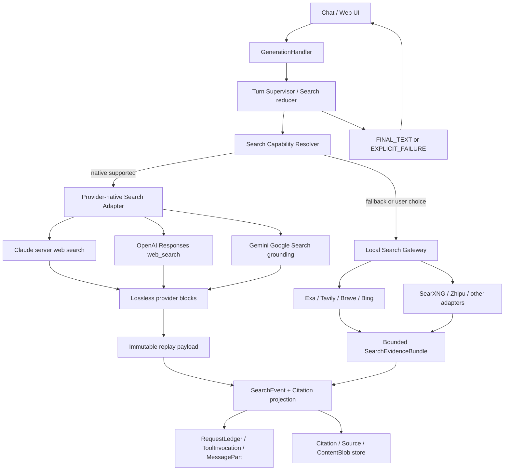
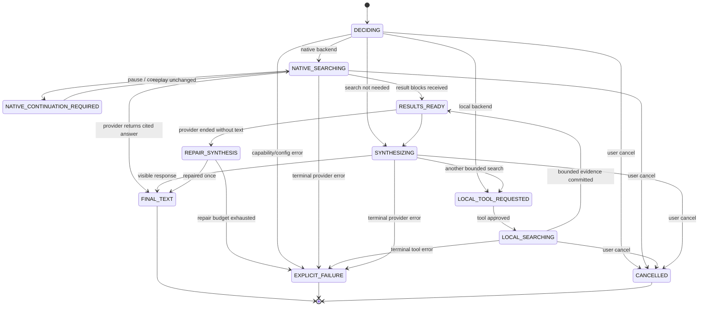

# RikkaHub Web Search 正式架构方案

> 状态：建议采用；后续实现依据（Proposal v1.1）
> 日期：2026-08-07
> 范围：聊天生成链路中的 Provider 原生搜索、本地搜索服务、搜索结果预算、引用、状态恢复与可观测性
> 核心决策：采用“Provider 原生搜索优先 + 本地 Search Gateway 兜底 + Search Turn Supervisor 统一收口”的三层架构。

## 1. 文档地位

本文定义 RikkaHub Web Search 的目标架构、不可破坏的运行时合同、Provider 接入边界、迁移顺序和验收门槛。后续可以按本文工作包逐阶段实施，但本文自身不授权立即修改运行时代码。

本文与现有架构的关系：

- `PALE6_FOUNDATION_ARCHITECTURE.md` 中的 RequestLedger、ToolInvocation、Citation/Source 和单一权威状态原则继续有效。
- Search Turn Supervisor 是统一 Turn/Continuity Supervisor 内的搜索专用 reducer，不创建第二套请求生命周期；需要持久化的状态投影到 RequestLedger、ToolInvocation、MessagePart 和 Citation/Source。
- Provider 返回的原生搜索块先进入不可变 replay payload，再生成模型上下文和 UI 投影；不能为了统一格式而丢掉 Provider 的继续请求凭据、加密字段或引用定位信息，也不能把所有原始块永久塞回模型上下文。
- 本方案不要求废弃现有 `:search` 模块。现有搜索 Provider 将收敛为 Local Search Gateway 的适配器。
- 本文的跨能力依赖、实施顺序和统一完成定义由 `AI_CONTEXT_MEMORY_CONTINUITY_ROADMAP.md` 统筹；本文继续作为 Web Search 垂直领域的详细合同。

## 2. 执行结论

RikkaHub 不再把 Web Search 仅视为一个返回 JSON 文本的普通函数工具，而把它提升为 generation 协议中的一等能力。

正式方案由三层组成：

1. **Provider-native Search**：Claude、OpenAI、Gemini 等 Provider 在模型与 API surface 支持时，直接使用服务端搜索工具，保留其搜索步骤、最终文本、引用和继续请求语义。
2. **Local Search Gateway**：对于不支持原生搜索的 Provider、用户强制选择自定义搜索服务、或原生能力不可用的场景，继续使用 Exa、Tavily、Brave、Bing、SearXNG 等本地适配器，但只向模型注入有严格预算的标准化证据包。
3. **Search Turn Supervisor**：在 Provider 和工具之上统一管理搜索状态、继续请求、预算、失败、取消和最终回复合同。

最重要的系统不变量是：

> 一旦本轮已经获得任何搜索结果，generation 不得以“只有搜索步骤或工具结果、没有用户可见回复”的形式静默结束；它必须产生最终文本，或产生明确、可见、可重试的失败结果。

因此，“搜索了 30 多个网站后没有后续回复”不是可接受的偶发体验，而是 `RESULTS_READY_WITHOUT_TERMINAL_RESPONSE` 协议违约，必须被状态机阻止、被日志记录、被测试覆盖。

## 3. 当前问题与对照结论

### 3.1 RikkaHub 当前链路

当前实现存在四个相互放大的风险：

- `app/.../SearchTools.kt` 的 `search_web` 把 `answer/items/images` 整体序列化为文本工具结果；结果数和正文长度缺少统一硬上限。
- `GenerationHandler.generateText()` 虽然会在 client tool call 后继续调用模型，但总循环耗尽、Provider 非标准终态或上下文被工具结果挤满时，没有“搜索结果后必须有最终回复”的独立收口合同。
- `GenerationHandler.maybeTruncateToolOutput()` 只在 Assistant 拥有 workspace shell 时持久化大结果。普通搜索 Assistant 没有 shell 时，大结果仍会完整进入下一轮上下文。
- Provider 适配器对服务端工具的内容块、引用和终态支持不一致。例如当前 OpenAI Responses 流主要在 `response.completed` 时关闭；Claude 消息解析主要覆盖 `text/thinking/tool_use`，尚未形成 `server_tool_use`、`web_search_tool_result` 和 `pause_turn` 的完整协议。

这意味着问题并不只是“搜索结果太多”，而是搜索结果体积、Provider 终态、消息模型和 generation 收口之间缺少统一治理。

### 3.2 `G:\claude-code` 对照实现

本次参考的 `claude-code-best/claude-code` 是第三方重建与扩展项目，不应当被当作 Anthropic 官方 Claude Code 源码。审阅基线为本地仓库 commit `2ccc216289833994ba3121afdd95b694126d495c`。

其中值得吸收的做法：

- 主模型只看到一个稳定的 `WebSearch` client tool，搜索后端由 adapter 选择。
- tool loop 在拿到 client `tool_use` 后继续运行，不把工具完成误当成对话完成。
- 大型工具结果有全量持久化、短预览和整轮聚合预算，避免无限挤占上下文。
- 搜索后端可以在 API、Bing、Brave、Exa、Tavily 之间切换。

不应直接复制的部分：

- `api` adapter 通过第二次 Claude 请求执行 `web_search_20250305`，再把结果压缩成标题和 URL 返回主模型。这会丢失原生引用、加密内容、停止原因和同一模型回合内的搜索语义。
- 固定旧版工具类型不适合多平台、多模型和持续演进的 Provider 能力矩阵。
- 未形成面向 `pause_turn` 的无损重放合同，也没有独立的“搜索结果后必须最终回复”硬不变量。
- 第三方默认搜索端点不能成为 RikkaHub 的隐式默认信任边界。

RikkaHub 应学习其“adapter + loop + output budget”骨架，但采用更完整的 Provider 原生协议和更严格的终态治理。

## 4. 不可破坏的原则

1. **最终回复是协议终态，不是模型善意。** 有结果后必须得到 `FINAL_TEXT` 或 `EXPLICIT_FAILURE`。
2. **原生能力优先，但不强行假装统一。** 每个 Provider 保留自己的内容块、停止原因、继续令牌和引用元数据。
3. **统一的是领域语义，不是原始 JSON。** UI 和上层编排使用统一投影；Provider adapter 仍保存无损原始块。
4. **搜索预算独立于 generation 总步数。** 不能用现有 `maxSteps` 代替搜索次数、结果数、上下文体积和继续次数限制。
5. **模型上下文不是搜索结果仓库。** 全量结果可以持久化，但只把有界、去重、排序后的证据注入模型。
6. **引用来源只有一套权威。** Provider 原生 annotation 和本地搜索结果都投影到 Citation/Source，不再依赖 Markdown 猜测作为长期真值。
7. **失败必须可见且可分类。** 取消、超时、搜索限额、Provider 拒绝、上下文超限、解析失败和网络失败不能都表现成“停止生成”。
8. **Capability 必须冻结。** 一轮请求开始时解析并保存实际采用的搜索 backend、工具版本、限制和引用能力，中途设置变化不改写在途请求。
9. **搜索内容是不可信外部输入。** 网页内容不得覆盖系统指令、泄露凭据或隐式触发本地工具。
10. **隐私选择高于能力优先级。** 用户强制本地搜索、禁用联网或限制域名时，不得自动切回 Provider 原生搜索。
11. **原始记录、重放载荷、模型上下文三层分离。** 原始记录不可变；Provider 重放只取协议必需块；模型只读取按本轮预算编译的 Context Manifest。
12. **搜索命中不等于证据。** `DISCOVERED`、`FETCHED/OPENED`、`CITED` 是不同阶段；只有具有可追溯来源、快照和校验状态的内容才可作为强证据。

## 5. 目标架构



依赖方向：

- `:pale` 或未来 shared product kernel 定义纯 Kotlin 的 Turn/Search reducer、终态、预算与恢复决策；`:ai` 定义 Provider 原生块和 codec，不依赖具体 UI。
- `:search` 定义 Local Search Gateway、搜索 Provider adapter 和标准证据包，不负责 generation 循环。
- `:app` 的 GenerationHandler 只承载宿主集成、权限、设置快照、网络执行和持久化协调，不成为状态机语义的唯一实现位置。
- Citation/Source、RequestLedger 就绪后成为长期持久化真值；在迁移期允许 MessagePart 中保留兼容投影，但不能形成新的永久旁路。

## 6. 搜索模式与能力解析

### 6.1 用户可见模式

Assistant 或会话级配置使用四种模式：

| 模式 | 行为 |
| --- | --- |
| `AUTO` | 优先使用当前 Provider 的原生搜索；不支持或显式不可用时使用已配置的 Local Search Gateway |
| `NATIVE_ONLY` | 只允许 Provider 原生搜索；能力不满足时在发送前明确报错 |
| `LOCAL_ONLY` | 只使用用户选择的本地搜索 Provider，不向模型 Provider 暴露原生搜索工具 |
| `DISABLED` | 本轮禁止联网搜索；模型要求搜索时返回明确的 capability 错误 |

不建议增加含义模糊的“增强搜索”开关。UI 应展示本轮实际解析出的 backend，例如“Claude 原生搜索”或“Tavily（本地工具）”。

### 6.2 CapabilitySnapshot

每次请求冻结以下能力快照：

```text
SearchCapabilitySnapshot
  providerId
  apiSurface
  modelId
  resolvedMode
  backend = NATIVE | LOCAL | DISABLED
  nativeToolFamily
  nativeToolVersion
  supportsCitations
  supportsDomainFilters
  supportsLocation
  supportsPauseContinuation
  supportsRawResultInclusionControl
  supportsSearchAction
  supportsOpenPageAction
  supportsFindInPageAction
  supportsLiveAccessControl
  supportsReturnedTokenBudget
  supportsImageSearch
  supportsProviderGovernedUiPayload
  maxSearchUses
  nativeBudgetControlMode
  localProviderId?
  budgetPolicyVersion
```

Resolver 的顺序固定为：用户隐私/禁用约束 → API surface 能力 → 模型能力 → Provider/地区/组织限制 → Assistant 偏好 → fallback 可用性。不能只根据模型名称字符串猜测能力；能力表需要版本化，并允许 Provider 在 400 capability error 后降级，但只允许在请求尚未产生可计费结果时降级。

## 7. 领域模型

### 7.1 原生块与统一投影

`UIMessagePart` 需要能够表达而不损失以下语义：

- `ServerToolUse`：Provider 在服务端发起的搜索、打开页面或页内查找步骤。
- `ServerToolResult`：成功结果、空结果或结构化错误。
- `ProviderContinuation`：例如 Claude `pause_turn` 所要求的完整 assistant message 重放信息。
- `Text` + `CitationAnnotation`：最终文本和精确字符区间引用。
- `ProviderOpaqueBlock`：尚未被公共模型认识、但下一轮必须原样回传的块。

统一 UI 投影使用：

```text
SearchEvent
  eventId
  requestId / attemptId
  backend
  provider
  query
  phase
  resultCount
  uniqueDomainCount
  error?
  startedAt / completedAt

SearchEvidence
  sourceId
  providerSourceId?
  rawUrl
  canonicalUrl
  title
  snippet
  domain
  publishedAt?
  lastModifiedAt?
  retrievedAt
  evidenceStage = DISCOVERED | FETCHED | OPENED | CITED
  contentHash?
  fetchStatus?
  providerRank?
  contentBlobId?

CitationAnnotation
  citationId
  sourceId
  messagePartId
  startIndex / endIndex
  offsetUnit
  citedTextHash
  providerPayload?
```

Provider 原始块和统一投影不是二选一：前者保证协议可继续，后者保证 UI、持久化和跨 Provider 功能一致。

`rawUrl`、Provider source ID 和 canonical identity 必须同时保留。canonical URL 用于安全去重，但不得假设它能唯一标识所有内容：带时效签名的 URL、同一 DOI 的多个入口、内容漂移和镜像站需要结合 Provider ID、内容 hash 与 canonicalizer 版本判断。

### 7.2 终态模型

Search Turn 的终态只允许：

- `SUCCEEDED_WITH_FINAL_TEXT`
- `EXPLICIT_FAILURE`
- `CANCELLED_BY_USER`
- `REFUSED_WITH_VISIBLE_TEXT`

`RESULTS_READY`、`TOOL_RESULT_COMMITTED`、`PAUSED`、`STREAM_CLOSED`、`MAX_STEPS_REACHED` 都不是合法终态。

## 8. Search Turn Supervisor 状态机



### 8.1 关键转移规则

- Provider-native 搜索可能在一次 API 请求内完成搜索与合成；Supervisor 仍要从事件流中记录 `SEARCHING → RESULTS_READY → FINAL_TEXT` 的逻辑进度。
- Client tool 搜索必须在工具结果提交后继续 generation。只写入 tool result 并关闭流属于协议错误。
- Claude 返回 `pause_turn` 时，必须把暂停的 assistant message 原样加入下一次请求；不得重新序列化成普通 tool result，也不得修改其中的加密搜索内容。继续次数耗尽后进入明确失败。
- Claude 同时请求 server tool 与 client tool 时，按 Provider 协议先完成 client tool result，再让服务端搜索继续；不能本地伪造 server tool result。
- 流收到 EOF、`[DONE]` 或 transport close 只代表传输结束。Supervisor 必须根据 Provider terminal event 和已积累内容决定真正终态。
- 搜索已有结果但没有最终文本时，允许最多两次无新搜索的 repair synthesis；repair prompt 只要求基于已有证据完成回复。两次仍失败则生成本地明确错误消息，不再静默退出。
- generation 全局步数耗尽时必须写入 `EXPLICIT_FAILURE(MAX_STEPS_EXHAUSTED)`；如果已有部分文本则保留部分文本并标记未完成。

## 9. 预算与上下文治理

预算需要同时限制搜索次数、结果数、单条长度、整轮注入量和持续时间。建议 v1 默认值：

| 预算 | 默认 | 硬上限 | 说明 |
| --- | ---: | ---: | --- |
| 单次本地搜索结果数 | 8 | 20 | Provider 返回更多时先排序、去重再截断 |
| 单条 snippet | 1,200 字符 | 2,000 字符 | 按 Unicode 字符安全截断，保留标题和 URL |
| 单次本地工具注入 | 32,000 字符 | 48,000 字符 | 超出部分只存 raw payload，不进入模型上下文 |
| 整轮本地搜索注入 | 64,000 字符 | 96,000 字符 | 跨并行和多轮搜索聚合计算 |
| 交互式搜索调用数 | 8 | 20 | native 与 local 都计入；Research profile 可提高默认值 |
| native continuation | 5 | 8 | 专用于 `pause_turn` 等 Provider 继续请求 |
| repair synthesis | 1 | 2 | repair 阶段禁止再次搜索 |
| 搜索墙钟时间 | 120 秒 | 300 秒 | 后台 Research 使用独立任务合同，不复用交互式上限 |

这些值是初始工程策略，不是写死在 Provider adapter 中的常量。`SearchBudgetPolicy` 必须版本化，并在请求快照中记录实际值。

预算分为两类，不能伪装成同一种精度：

- Local Gateway 对 result count、字符/字节、单条长度和整轮注入量实施确定性硬限制。
- Native Search 只映射 Provider 实际提供的控制项，例如 `max_uses`、搜索上下文档位、返回预算枚举、是否返回 sources/results 和实时/缓存访问模式；这些值是能力约束，不是精确注入 token 保证。实际使用量必须通过响应元数据与本地观测记录。

### 9.1 大结果处理

所有 Assistant 都应用大工具结果治理，不再以是否拥有 shell 作为前提：

1. 原始响应写入通用 `ContentBlobStore`，计算 hash、MIME、字节数、owner、隐私域、加密和保留策略；不要另建只供搜索使用的永久 blob 真值。
2. 模型只收到 `SearchEvidenceBundle`，包含查询、截断说明、排序后的证据和 `contentBlobId`。
3. UI 可以按需读取全量结果，但不得把本地绝对路径或内部凭据暴露给模型。
4. 不拥有 workspace shell 的 Assistant 也可以通过受控 `read_tool_result(handle, range)` 读取后续片段；该能力必须有长度上限，不能退化成任意文件读取。
5. 同 URL 先 canonicalize，再结合 Provider source ID/content hash 去重；镜像站和追踪参数不得重复消耗预算，canonicalizer 版本写入请求快照。

### 9.2 标准证据包

Local Search Gateway 返回结构化对象，不再返回随 Provider 变化的整块 JSON 文本：

```json
{
  "query": "...",
  "resultCount": 8,
  "truncated": true,
  "results": [
    {
      "sourceId": "...",
      "title": "...",
      "url": "https://...",
      "domain": "example.com",
      "snippet": "...",
      "publishedAt": null
    }
  ],
  "contentBlobId": "blob:..."
}
```

图片搜索结果使用单独的 `ImageSearchEvidence`，不把几十个图片 URL 混入文本证据包。

## 10. Provider 原生适配

### 10.1 Claude

Claude adapter 必须实现完整的 server tool 协议，而不是把 Web Search 降格为普通 function call：

- 工具版本由 capability table 选择，不把 `web_search_20250305` 永久硬编码为唯一版本。
- 支持 `server_tool_use`、`web_search_tool_result`、引用、结构化搜索错误和 `pause_turn`。
- 搜索成功结果中的 `encrypted_content`、引用中的加密定位信息及未知原生字段必须无损持久化并在后续消息中原样回传。
- 搜索错误通常出现在 HTTP 200 的 result block 中；`content` 可能是错误对象而非结果数组，解析器必须显式区分。
- 组织禁用、平台不支持等请求级 4xx 在 dispatch 前后按 billable boundary 分类，不自动无限 fallback。
- `max_uses` 由 SearchBudgetPolicy 写入；域名过滤和用户位置只有在用户允许且 Provider 支持时传递。
- 新版本的动态过滤或 response inclusion 只能通过能力协商启用；不能假设 Claude API、Vertex、Bedrock 和其他兼容端点能力一致。

### 10.2 OpenAI

新接入以 Responses API 的 `web_search` 为主：

- 保留 `web_search_call` action、状态、可选 sources/results 和最终 `output_text` 的 `url_citation` annotations。
- capability table 明确区分 `search`、`open_page`、`find_in_page`，并记录 domain filter、`search_context_size`、`return_token_budget`、图片结果与 `external_web_access` 等能力；不把档位或枚举误报成精确 token 配额。
- SSE 必须显式处理 `response.completed`、`response.incomplete`、`response.failed` 和 transport failure；不能只等待 completed 或 `[DONE]`。
- `web_search_call.status=completed` 不代表整个 turn 已完成，只有最终 message/terminal outcome 才能收口。
- `response.incomplete` 如果已有搜索结果但没有最终文本，进入可分类的 repair 或显式失败，不直接关闭 UI loading。
- Chat Completions 旧搜索面只作为兼容路径，不作为新架构主干。

### 10.3 Gemini

Gemini adapter 使用对应 API surface 的 Google Search grounding：

- 保留 `google_search_call`、查询、结果/建议步骤、最终 text 和 `url_citation` annotations。
- Provider 已经完成“搜索—处理—合成”时，不再把 grounding 结果二次包装成 client tool result 让模型重复总结。
- 搜索建议等带展示条款的 Provider UI 数据作为 `ProviderGovernedUiPayload` 与普通 Citation 分开建模，保存条款版本、展示范围和安全投影，按 Provider 要求渲染，不能在通用 transformer 中丢弃或改写。
- 旧模型或旧 API surface 的工具名称差异由 capability table 解决，不渗透到通用 generation 层。

### 10.4 其他 Provider

其他 Provider 只有在满足以下合同后才登记为 native backend：

- 能明确识别搜索步骤与最终文本；
- 能识别成功、失败、未完成和取消；
- 引用元数据可无损解析；
- 多轮继续所需字段可无损保存；
- 有测试证明不会以 tool-only 输出静默终止。

否则一律走 Local Search Gateway，不通过兼容端点名称猜测原生能力。

## 11. Local Search Gateway

`:search` 模块保留各搜索服务的网络实现，但增加统一 Gateway：

```text
LocalSearchGateway
  search(request, budget): SearchEvidenceBundle
  fetch(request, budget): FetchedEvidence
  capabilities(providerId): LocalSearchCapabilities
```

Gateway 负责：

- 参数校验和统一 `resultSize` 硬上限；
- timeout、retry、rate limit 和错误分类；
- 搜索命中、打开/抓取页面、页内查找的阶段化证据获取；
- canonical URL、Provider source ID/content hash 去重、排序和域名统计；
- 查询与抓取缓存的 TTL、freshness、offline/cache-only 状态和用户隐私分区；
- HTML/JSON 清洗及 snippet 限长；
- 原始响应持久化与 bounded evidence 生成；
- 对搜索结果中的 prompt injection 进行不可信内容标记；
- 将 Provider 特有的 answer/images/metadata 映射为稳定合同。

各搜索 adapter 不负责：

- 决定是否继续调用 LLM；
- 拼接 generation prompt；
- 判断最终对话是否完成；
- 直接写 UIMessage 或 Citation 数据库。

本地 fallback 触发条件必须明确：用户选择 `LOCAL_ONLY`、当前模型无原生能力、API surface 不支持、Provider 原生功能在发送前被确认禁用，或 `AUTO` 下出现可安全降级的 capability error。已经产生搜索结果或可能计费后，不自动切换另一搜索后端重复执行。

## 12. 引用、消息与持久化

### 12.1 引用权威

长期引用链为：

```text
Provider annotation / Local SearchEvidence
  → Source
  → CitationAnnotation(messagePartId, range)
  → Android / Web / Export renderer
```

- Provider 原生引用的字符区间和 source 元数据优先于 Markdown URL 猜测。
- 本地搜索合成时，模型应引用稳定 `sourceId`；输出 transformer 将其解析为 CitationAnnotation。
- Markdown 脚注和旧 `search_web` JSON 解析只作为迁移兼容，不再产生更高优先级的引用真值。
- Android、Web 和导出必须使用同一 Citation projection，引用应可点击、可追溯且不会因重新渲染改变来源。
- Provider 坐标只转换一次到应用标准 `UTF-16` text-part span；转换时保存 provider offset unit、part ordinal、源文本 hash 和 projector version。任何 transformer 改写被引用文本后都必须重投影或显式标记 citation invalid，禁止静默漂移。
- 提交前先做确定性校验：source 存在、URL 安全、span 边界合法、引用文本 hash 匹配、payload 未越过隐私域；LLM judge 只能作为证据质量的附加评估，不能替代这些硬检查。

### 12.2 无损重放

需要再次发给 Provider 的原生块必须保留：

- 原始块类型、顺序和 ID；
- 加密内容、签名和 Provider continuation 字段；
- tool/result 配对关系；
- assistant message 的完整边界；
- Provider/API surface/schema version。

未知字段不得在 decode/encode 往返中丢失。必要时使用带 schema version 的 opaque payload；UI 只读取安全投影。

### 12.3 与 RequestLedger 集成

- 一次用户发送是 Request；每次实际 Provider 请求是 RequestAttempt。
- client search 是 ToolInvocation；server search 是 RequestAttempt 下的 SearchEvent，不伪造 client ToolInvocation。
- `RESULTS_READY` 表示已有可计费/有价值输出，进程恢复时只允许继续本地提交或合成，不得无条件重新搜索。
- 搜索查询、域名、result count 和 payload hash 可进入脱敏审计；完整网页内容不进入普通日志。

## 13. UI 与用户体验

搜索过程应呈现为一个可折叠的过程，而不是连续刷出几十张工具卡：

- 进行中：显示当前 backend、已执行查询数、已发现来源数和耗时。
- 完成：默认折叠为“搜索了 N 次，参考 M 个来源”，展开后按查询分组。
- 合成中：搜索卡保留完成状态，回复区域明确显示“正在整理答案”，避免用户误判为卡死。
- 失败：显示失败阶段、是否已有结果、是否可仅基于已有结果重试合成、是否可能重复计费。
- 结果已就绪时提供“停止继续搜索，基于现有资料回答”；该操作只触发合成，不发起新的搜索或 fetch。
- 长时 Research 不伪装成普通交互回合：复用 Evidence/Citation/ContentBlob 合同，但采用独立的 Research Job Supervisor、后台通知和恢复预算。
- 取消：立即停止可取消的本地请求；Provider 远端是否已停止按真实能力显示，不虚构成功取消。
- 引用：正文内可点击，来源列表去重；Native 和 Local 的视觉语义一致，但调试面板可显示实际 backend。

对于 30 个以上原始来源，默认 UI 只展示最终被引用或排名靠前的来源，其余在“查看全部搜索结果”中按需加载，不能把来源数量等同于上下文注入数量。

## 14. 可观测性与故障诊断

每轮记录结构化指标：

```text
requestId / attemptId
provider / model / apiSurface
resolvedSearchMode / backend / toolVersion
searchRequestCount / queryCount
rawResultCount / injectedResultCount / uniqueDomainCount
rawPayloadBytes / injectedChars / estimatedInjectedTokens
pauseContinuationCount / clientToolRoundCount / repairCount
providerStopReason / providerTerminalEvent
finalTextEmitted / citationCount
terminalOutcome / failureClass
timeToFirstSearch / searchLatency / synthesisLatency / totalLatency
```

必须建立以下质量指标：

- `search_turn_final_response_rate`
- `results_ready_without_final_total`，目标恒为 0
- `search_payload_truncation_rate`
- `search_repair_rate` 与 repair 成功率
- `provider_terminal_unknown_total`
- `citation_projection_failure_rate`
- 每 Provider 的搜索调用数、延迟、错误率和估算成本

发生协议违约时保存脱敏 trace：状态转移、事件类型、字节/字符数量、stop reason 和 hash。不得把 API key、完整 header、用户隐私查询或网页全文写入普通日志。

## 15. 安全与隐私

- 搜索 query 在发送前经过凭据和明显秘密检测；命中高风险内容时要求确认或拒绝发送。
- 网页文本在结构化 part 上携带 taint/provenance，工具授权器拒绝由 Web 内容提升权限；`UNTRUSTED_WEB_CONTENT` 文本标记和 system prompt 仅是第二道防线。
- fetch/scrape 必须阻止 localhost、私网、metadata endpoint、非 HTTP(S) scheme、重定向逃逸和超大响应，避免 SSRF。
- 域名 allow/block 规则在 Local Gateway 和支持的 native provider 中使用同一用户意图，但分别按 Provider 语法编码。
- 精确位置默认不发送；只允许用户授权的近似位置。
- 全量 raw payload 遵循受管理文件的保留、加密、清理和备份策略，不进入未加密的调试导出。
- 任何第三方公共代理端点必须显式配置和提示数据去向，不作为默认内置秘密后端。

## 16. 分阶段实施路线

### WS-0：合同、测试夹具与观测基线

交付：

- 定义 SearchTurnState、TerminalOutcome、SearchCapabilitySnapshot 和失败分类。
- 复用统一 Turn reducer 与 ContentBlob/Context Manifest 合同，不在 Search 内建立第二套请求状态机或 raw payload 仓库。
- 为当前 generation 链路增加只读事件观测，复现“多结果、无最终回复”。
- 建立 Claude/OpenAI/Gemini/native 与 local 的录制响应夹具，不调用真实付费 API。
- 把 `results_ready_without_final` 加入测试和诊断日志。

门禁：能够稳定判断一次失败究竟是结果过大、Provider 未完成、解析丢块、步数耗尽还是 UI 未提交。

### WS-1：先修复终态与静默退出

交付：

- Search Turn Supervisor 最小完整状态机。
- OpenAI Responses 的 completed/incomplete/failed/transport terminal 映射。
- client tool result 后的强制继续与有界 repair synthesis。
- max steps、EOF、取消和异常全部形成明确终态。

门禁：现有 `search_web` 即使返回 30 个结果，也只能得到最终文本或明确失败，不能无回复结束。

### WS-2：结果预算与 Local Search Gateway

交付：

- 统一 resultSize、snippet、单次/整轮 payload 预算。
- canonical identity、去重、排序、ContentBlob store 和受控分段读取。
- 搜索命中/打开页面/页内查找的证据阶段、freshness 与 cache-only/live 状态。
- 现有搜索 Provider 迁入 Gateway adapter 合同。
- Android/Web 搜索过程聚合 UI。

门禁：500 KB 原始结果不会完整进入模型上下文；没有 workspace shell 的 Assistant 同样受预算保护。

### WS-3：Claude 原生搜索

交付：

- Claude server tool 内容块、stream event、结构化错误、引用和 `pause_turn`。
- 原生块无损持久化与多轮重放。
- API surface/model capability table 与版本选择。
- native/local 模式选择和安全 fallback。

门禁：录制夹具覆盖直接成功、空结果、HTTP 200 搜索错误、并行 client/server tool、pause continuation、未知块往返和最终引用。

### WS-4：OpenAI 与 Gemini 原生搜索统一接入

交付：

- OpenAI `web_search_call`、sources/results、annotation 和所有终态。
- Gemini search/grounding steps、annotation 和展示要求。
- 统一 SearchEvent/Citation projection，不抹平 Provider 原始协议。

门禁：三个原生 Provider 和 Local Gateway 使用同一 Supervisor 终态合同与 UI 投影。

### WS-5：持久化、恢复与旧路径收口

交付：

- 与 RequestLedger、ToolInvocation、Citation/Source 正式集成。
- 进程死亡恢复：有结果时只恢复提交/合成，不重复搜索。
- 迁移旧 `search_web` 引用和 MessagePart 兼容投影。
- 删除重复的 Provider 搜索旁路和不再使用的 Markdown/JSON 猜测路径。

门禁：升级、进程重启、分支切换、导出和 Web 客户端都保留引用和明确终态。

## 17. 验证矩阵

| 场景 | 必须验证的结果 |
| --- | --- |
| Local provider 返回 30/100 条结果 | 注入量受限、raw payload 可追溯、最终回复存在 |
| 三个并行 client search tool | tool/result 配对正确，只触发一次后续合成 |
| 单次结果 60 KB / 500 KB | 分别触发截断和 raw store；无 OOM、无上下文爆炸 |
| 搜索结果为空 | 模型明确说明未找到，或继续一次有界查询 |
| Claude `pause_turn` | assistant message 原样重放，次数有界，最终回复或明确失败 |
| Claude search error in HTTP 200 | 解析为结构化失败，不把错误对象当结果数组 |
| Claude client/server tool 同组 | 先完成 client tool，再继续 server search |
| OpenAI `response.incomplete` | 不误报成功；已有结果时 repair 或明确失败 |
| OpenAI `response.failed` | 流正常关闭且 UI 收到明确错误 |
| Gemini grounded response | 查询步骤、最终文本和 citation annotation 均保留 |
| transport EOF without terminal event | 标记 terminal unknown/failed，不静默结束 |
| generation max steps | 明确 `MAX_STEPS_EXHAUSTED`，保留已有部分结果 |
| 用户取消 | 状态为 CANCELLED，说明远端请求是否可能仍已执行 |
| 进程在 RESULTS_READY 后死亡 | 恢复只做合成/提交，不自动重复搜索 |
| citation 文本被 transformer 改写 | 重投影或明确失效，不出现错位可点击引用 |
| live/cache-only/offline 搜索 | UI 与审计准确显示数据新鲜度，不把缓存结果冒充实时结果 |
| 用户选择“基于现有资料回答” | 禁止新搜索，只基于已提交 Evidence 合成 |
| 搜索网页含 prompt injection | 不改变 system/tool 权限，不泄露秘密 |
| Android 与 Web UI | 相同来源与引用 authority，终态显示一致 |

测试分层：

- 纯 Kotlin 状态机和预算属性测试；
- Provider adapter 录制事件流/JSON contract tests；
- GenerationHandler 集成测试；
- Room/RequestLedger 恢复测试；
- Android 与 Web UI 状态投影测试；
- 少量显式开启的 live smoke test，不作为默认单元测试依赖。

## 18. 正式验收标准

方案完成的最低标准不是“能搜到网页”，而是同时满足：

1. 支持 Claude、OpenAI、Gemini 的原生搜索和任一 Local Search Provider。
2. `results_ready_without_final_total` 在发布门禁测试中恒为 0。
3. 所有 Provider 终态、暂停、失败、取消和步数耗尽都有用户可见结果。
4. 30+ 来源与 500 KB 原始结果不会无界进入模型上下文。
5. Provider 原生块可无损往返，Claude 加密搜索字段不会在持久化后丢失。
6. 引用在 Android、Web 和导出中保持同一来源真值并可点击。
7. 进程恢复不会在已有搜索结果时自动造成重复搜索或重复计费。
8. 用户能明确知道使用的是 Provider 原生搜索还是自定义本地搜索服务。
9. 搜索过程有可诊断指标，但日志不泄露凭据和网页全文。
10. 旧 `search_web` 用户配置与历史消息可兼容迁移，不需要清空会话。

## 19. 暂缓决策

以下事项在对应工作包开始前确认，不阻塞本方案作为骨架：

- SearchBudgetPolicy 默认值是否按模型上下文窗口动态缩放；硬上限仍必须存在。
- Research Job Supervisor 的首版范围、后台预算和 UI；架构已确定它复用 Evidence/Citation/ContentBlob，但不直接复用交互式 Search Turn 的生命周期与上限。
- ContentBlob 的物理复用方式与 MediaAsset blob/managed files 的迁移顺序；领域层已确定只保留一个通用不可变内容合同，不再新增 search-only raw store。
- Native 搜索计费信息在普通聊天 UI 中展示到什么粒度。
- 自建 metasearch/代理是否成为官方可选组件；即使采用，也不得成为无提示的默认数据出口。

## 20. 参考资料

- [Claude Web Search tool](https://platform.claude.com/docs/en/agents-and-tools/tool-use/web-search-tool)
- [Claude stop reasons and fallback](https://platform.claude.com/docs/en/build-with-claude/handling-stop-reasons)
- [OpenAI Web search](https://developers.openai.com/api/docs/guides/tools-web-search)
- [Gemini Grounding with Google Search](https://ai.google.dev/gemini-api/docs/google-search)
- [第三方 claude-code-best/claude-code](https://github.com/claude-code-best/claude-code)

这些 Provider 协议会持续演进。实现时应以 capability table 和 contract tests 消化变化，而不是在通用 generation 层散落模型名与工具版本判断。
